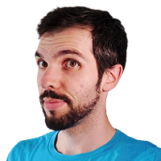

+++
author = "nathan"
title = "About us"
small = "GDQuest, its mission, and the people behind it"
date = "2017-04-10T13:40:07+02:00"
layout = "single"

paginate = false

[banner]
src = "./img/social-banner.png"
alt = "Godot course update 4 banner showing characters on a tiles-based map"
+++

## GDQuest's mission

GDQuest is a [Free Software](//en.wikipedia.org/wiki/Free_software) project and a social company. We invest all profit back into our projects.

Our mission is to **bring people together to become better game developers**.

We contribute to Free Software through education, communication, writing documentation, and coding Free and Open-Source tools.

## Free education

GDQuest is a growing library of [game creation tutorials](/tutorial) and [open-source projects](https://github.com/GDQuest/) to help you become the game developer you want to be. We use and support Free Software like the [Godot game engine](//godotengine.org/), [Krita](//krita.org/en/), and [Blender](//www.blender.org/).

## Get in touch

If you're looking for help with a given program, head to our [Discord](//discord.gg/KVaCsSP) server!

In general, you can find us on:

- [Discord](//discord.gg/KVaCsSP), the best place for questions or support. That's where we hang out with the community. If I'm away, other creators will be around to answer your questions.
- [Twitter](//twitter.com/NathanGDQuest) is a popular social network for game developers.

## The story of GDQuest

Hi, I'm Nathan, GDQuest's founder.

GDQuest was initially a small YouTube channel focused on game art tutorials.

Back then, we found that a lot of the available free 2D game art videos were step-by-step, like recipes to achieve specific results. We tried to approach teaching differently: to share the techniques used by professionals game artists and the related foundations.

At the time, it was a one-person hobby project. It was also unrelated to Free Software, as I didn't know much about that. The idea was to share the techniques professional game developers used and to make them accessible to everyone.

Our concept and mission evolved progressively. First, [Krita](//krita.org/en/) and its welcoming development team gave me the first taste of Free Software. We later moved onto covering the [Godot game engine](//godotengine.org/) and using Linux.
