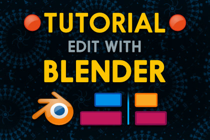

+++
aliases = ["/post/2017/12/godot-3-course-character-controller/"]
author = "nathan"
categories = ["news"]
date = "2017-12-25T15:54:59+01:00"
description = "10 videos, 1h 40mn of tutorials and 8 Godot examples are waiting for you in the Godot course on Gumroad."
keywords = ["gdquest"]
title = "Godot course Christmas update: The character controller"

[[resources]]
  name = "banner"
  src = "banner.png"
  [resources.params]
    alt = "Godot course update 3 banner, with a character jumping"

+++

The Christmas update of the Godot 3 course is out on Gumroad! It's available in all early access versions of the course: [Hobby](//gumroad.com/l/vmPA), [Indie](//gumroad.com/l/XEULZ) and [Pro](//gumroad.com/l/godot-tutorial-make-professional-2d-games).

Use the coupon code "early" to **get 20% off** while the course is in early access!

In this series, you'll learn how to create a fairly robust **character controller**: we're covering input, walk and run speed, handling collisions, adding a bump animation when the character hits something... with a lot of techniques exposed along the way.



I took care to not only make the code work, but to go beyond the basics. As you'll see the controller is **reusable**. That's something you won't find in the majority of online courses: using object-oriented design, both the AI and playable characters can share the same movement code.

As each chapter is a self-contained series, you can go ahead and watch it now! If you're a Kickstarter backer or already got the course, it's in your [Gumroad Library](//gumroad.com/library).

There is one more tutorial coming in the next update, as it wasn't ready in time for Christmas: the top-down jump mechanic. The one [I edited live with Blender](//www.youtube.com/watch?v=uVLtbNDRF4E) yesterday.

## Coming next

As every chapter is disconnected from the others, I'm looking to jump on Tilemaps. It's something you can use in almost every 2d game, part of the essential toolset. Combat mechanics should be next on the list. In any case I'll focus on chapters that all of you can access first, and tackle the Indie and Pro-only ones afterwards.

## Let's meet at the next GodotCon!

We'll talk about this again later but if you want to meet, I'll be at the [GodotCon](//gumroad.com/library) in Brussels along with Juan reduz Linietski himself and, Akien and many other Godoters on February 5 and 6. If you're only at the [FOSDEM](//fosdem.org/2018/) and want to meet, the plane's landing on Sunday morning, the 4th of February.

Merry Christmas!

*PS: you can now find [GDQuest on Instagram](//www.instagram.com/nathan_gdquest/) too*
