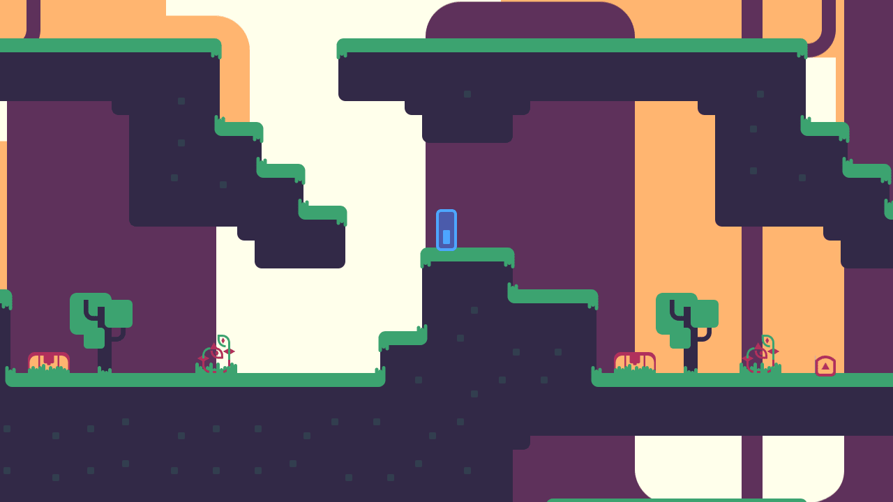

+++
title = "PCG Secrets: The Art of Procedural Generation in Godot"
description = "Learn to generate procedural game worlds with the free game engine Godot."
author = "zuzana"

date = 2020-06-02T09:23:39-06:00
weight = 5
draft = true

[[resources]]
  src = "pcg-secrets-banner.png"
  name = "banner"
+++

Check out our new series on procedural generation! This new advanced course will teach you to generate **procedural game worlds** with the free game engine Godot.

## What you will learn

In this course, you will learn to:

- Design and layer algorithms to create unique game worlds with code
- Use great programming practices to keep your code short and easy to read
- Make the most of random number generators

All that using Godot's GDScript programming language.

## Pre-requisites

To follow this course, you should be comfortable with code.

You should:

- Be able to work with Godot's editor. Make sure you know how to add nodes, resources within nodes, and use the Inspector.
- Have strong GDScript foundations.

If you have no experience with Godot, we wrote a complete [Free Godot guide for beginners](https://www.gdquest.com/docs/guides/learn-godot/beginner/) to get you started.

## Early Access

Get your hands on the course now for a **lower price** as we create new tutorials. The price will increase with the next update.

Once you bought the course, you get **lifetime free updates**. All the new content we add will come at no extra cost!



In this first release, the course covers the **Random Walker algorithm**, as seen in Spelunky. It's a general-purpose level generator that works for all sorts of games, 2D and 3D, although in the course's example, we cover a side-scrolling game.

We are working on the following topics for the next updates:

- Deterministic infinite world generation
- Guiding randomness with layered blue noise
- Generating procedural equipment and stats
- Shader-based world map with biomes

## Free and Open-Source

The code from this project is available under the MIT license. In short, you can use it and modify it freely, even in commercial projects.



By buying this course, you support GDQuest and the creation of Free Software.

Be sure to star 🌟 the project on GitHub! It helps more people find it.

We hope you enjoy this course and let us know what you think!
