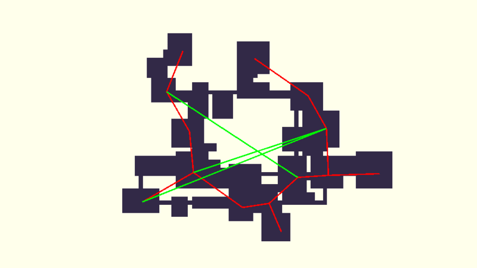
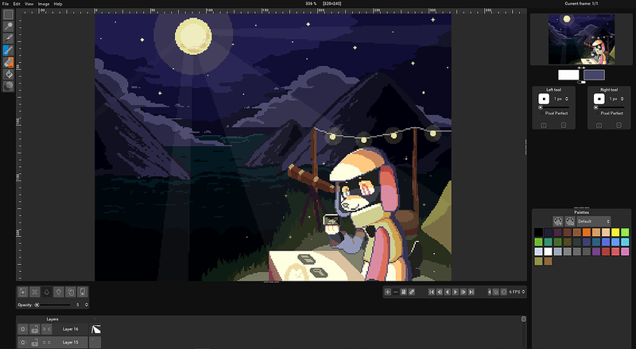

+++
title = "GDQuest weekly #3"
date = 2020-08-07
author = "nathan"
description = "This week, get new procedural generation algorithms, Godot tutorials, and a glimpse of our upcoming Kickstarter!"

draft=true

weight = 5

[banner]
src = "/img/newsletter-banner.png"
+++

This week, I'm coming to you with:

- New procedural algorithms.
- Four new tutorials dedicated to 2D games.
- Pixelorama, a Free pixel art program made in Godot.
- Our [new Kickstarter campaign](https://www.kickstarter.com/projects/gdquest/godot-2d-secrets-level-up-your-game-creation-skills) launching on August 15.

## Shaders and procedural content generation

[Godot procedural generation](https://github.com/GDQuest/godot-procedural-generation) got two new demos:

1. The MSTDungeon generator that uses **physics and minimum spanning trees**.
2. A system to create **procedural weapons**.

The minimum spanning tree generator creates dungeons that limit player backtracking. When a branch of the dungeon leads to a dead-end, the generator can add a loop that leads back to the main path.

It does that by generating a bunch of rooms, picking a few main ones, and finding the minimum graph that connects them. That's the minimum spanning tree.

When thinking of teaching procedural weapons, Razoric figured it'd be great to focus on procedural gameplay rather than stats.

With his system, you combine behaviors like having projectiles follow a target and swirling around. This combination produces swirling homing missiles. Add the laser modifier, and you get a swirling homing laser.

## New free tutorials

We have three new mini-tutorials:

1. [Local Multiplayer Input](https://www.gdquest.com/tutorial/godot/2d/local-multiplayer-input/)
1. [Spawning objects](https://www.gdquest.com/tutorial/godot/2d/spawning/)
1. [Scene transitions](https://www.gdquest.com/tutorial/godot/2d/scene-transition-rect/)

We also have a new video tutorial: [Code a Stomp Mechanic in Godot](https://youtu.be/Ait66HkjJgg).

## Recommended project: Pixelorama

[Pixelorama](https://orama-interactive.itch.io/pixelorama) is an MIT-licensed pixel art program made in Godot, coded in GDScript.

In little time, it's already become a powerful Free option to do pixel art. The source code is [on GitHub](https://github.com/Orama-Interactive/Pixelorama), where you can follow its development and contribute.

## Godot 2D Secrets: launching on August 15

We are running a new Kickstarter campaign to create tons of Free and Open-Source tutorials and demos, as well as a great Godot course.

The campaign starts on August 15 and will last only 14 days until the 29th.

We want to create tutorials that go straight to the point to accelerate your learning. We will produce short standalone guides about specific techniques and longer series about game mechanics like JRPG combat or real-time simulation.

With this ambitious project, we're looking to produce many more free and open-source tutorials and demos. Even more so than with previous Kickstarters. But that will only happen if the campaign succeeds, as we need the funds to pay everyone in the team.

I'll let you know when the campaign starts in the next newsletter. If you want to be among the first to back us, you can also follow us on the pre-launch page: https://www.kickstarter.com/projects/gdquest/godot-2d-secrets-level-up-your-game-creation-skills

We're also working on new videos for the channel to help promote Godot, and some exciting content during the campaign.

You'll get more details on the Kickstarter launch. Meanwhile, if you have any questions, you can reply to this email, and it'll get straight to me.

Ah, and for the occasion, we got [Tom](https://twitter.com/tomtusk) to work on some new characters and mascots for GDQuest.

See you soon in the next newsletter!
