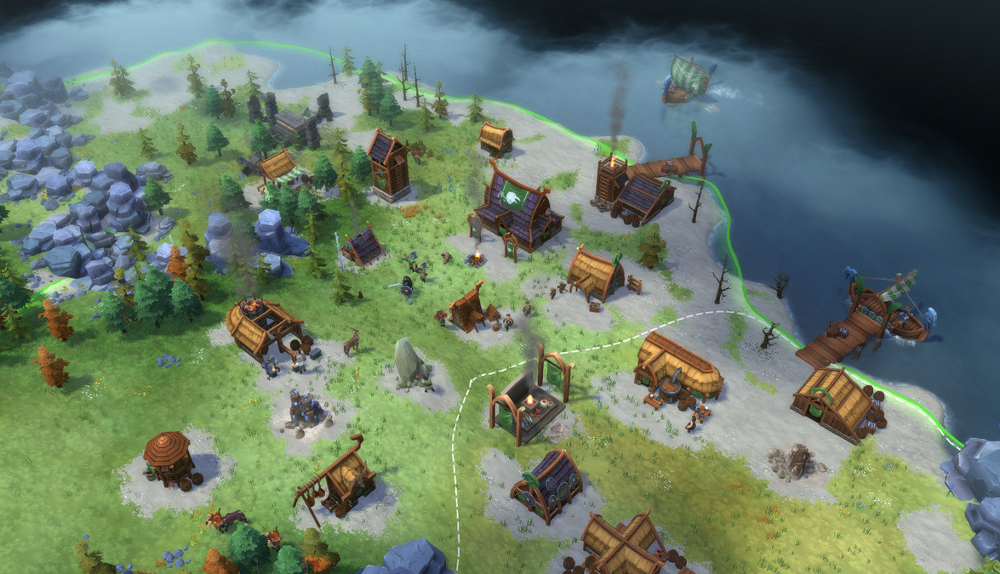
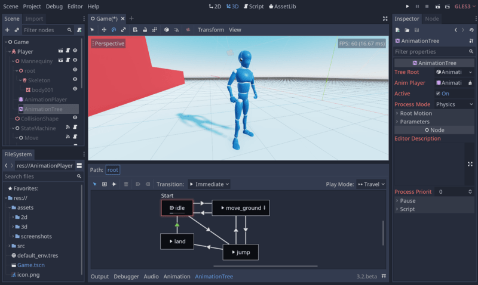
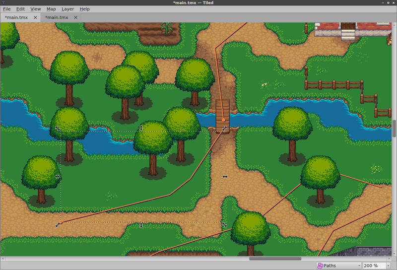
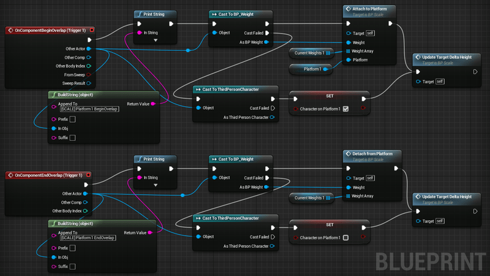

+++
title = "Choosing the right game engine"

description = "What do you have to think about when choosing the right game engine for you."
author = "razvan"
coAutors = ["nathan"]

date = 2020-08-18T18:25:08+03:00
weight = 3
+++

In this article, we are looking at a few questions you should ask yourself when browsing for game engines.

This guide is for people who already have some experience making games and would like to pick the right tool for their next project.

If you're just starting out, check out our guide [Game Engine Basics](). It will give you an introduction to game engines.

When it comes to picking the right tool for any job, there isn't a simple answer that works for everyone. Every developer has to weigh the pros of each option based on their needs. A framework that works well for us might not work for you. An engine that worked for your previous game might not be the best for the next project, either.

With that in mind, let's go over a few aspects to consider when browsing for a game engine.

## Proprietary VS open-source

Today, proprietary and open-source technologies coexist. It can be hard to pick one over the other. With some proprietary software, you may benefit from having a large, dedicated team of engineers developing polished editors and cutting-edge features. Some free and open-source projects are getting there, but when it comes to the user interface, sometimes, they may not be on par with closed-source counterparts.

On the other hand, the engine being a black box, as with Unity, can cost you in long projects. With a closed-source technology, you won't be able to fix a bug or optimize a part of the engine for your needs and may get stuck late in production. 

As fellow professionals can contribute with open-source projects, you may see bugs get fixed quickly by other teams. Engines like [PhaserJS](https://github.com/photonstorm/phaser) have hundreds of contributors.

Because their code is public, you can also look at existing issues, which helps assess whether the tool might work for you.

For hobbyists or independent developers, another benefit of open-source technologies is that they come at no cost. There are no fees that may apply to your sales or need to pay a special license to get access to more features.

Some proprietary tools are widely used in the industry, like Unity and the Unreal engine. They are developed by large companies and benefit from a vast ecosystem. You'll find plenty of training, paid assets, and plugins that can save you time. They also have excellent tools to author visual effects, shaders, or animations, for instance.

But in general, I'd still recommend anyone who has programming experience to seriously consider a free and open-source engine or framework over a proprietary one. Having access to the source code will save you headaches down the line.

You certainly don't need something like Unity to make great games. For instance, Dead Cells and Northgard are both developed with the Haxe-based engine [Heaps](https://heaps.io/).

## Documentation, support, and community

The maturity of **documentation, available training material, and support** plays a significant role. It cannot be underrated how vital documentation and education are.

Proprietary engines usually have the most thriving ecosystems. These companies have a product to sell and want you to be happy using it. The documentation of open-source projects tends to be lagging behind development because most people want to contribute to the source code.

With proprietary tools, there is often a broader market for professional instructors compared to free software, leading to a wide offer of paid training. Unity and Unreal are also commonly taught in game creation schools.

Community is an essential factor because much educational material stems from it. Having a friendly community is also important, so you can share knowledge, tips, and help when needed.

## Game editor and customization

We have two types of products when it comes to game engines. Products that come with a **visual editor** and Software Development Kits (SDKs) that only provide code.

A visual editor is simpler to use for non-programmers and artists. It makes a compelling reason to choose such a product. But SDKs are an important alternative. For an experienced developer, an SDK might just be the perfect tool. There are many factors to consider when it comes to this topic, but it's safe to say that most teams these days opt for game engines that come with visual editors.

The engine and editor are tightly constrained by the design choices of their developers, dictating your workflow. These days most editors provide a plugin architecture, allowing you to customize them. This is a powerful feature as it allows you to modify the editor and adapt it to your needs and workflow, saving you time on complex projects.

Using an SDK or framework, you will typically work with a variety of third-party programs like [Tiled](https://www.mapeditor.org/) to design levels, or [CastleDB](http://castledb.org/) to edit your data.

## Available programming languages

Depending on your background, supported programming languages can turn out to be a big factor. Not everyone is willing to learn a new language from scratch.

Artists and non-coders might prefer visual scripting languages. It's up to you and your team to work out the benefits of having a game engine with this option. These days, some mainstream game engines do come with a visual scripting language, like Unreal and its Blueprint technology.

On the other hand, a few engines come with a Domain Specific Language (DSL), which can put off programmers as they'll have to learn a new syntax. DSLs also tend to be specialized languages, designed to save you time. Still, they can have fewer features than general programming languages like, for example, C# or Python.

## Performances

Performance matters a lot on low-end devices or when you want to push the hardware with detailed 3D worlds or complex physics interactions. But its importance to ship games depends entirely on your project and target platform. Many devices these days are good enough to run even unoptimized projects, provided they aren't doing anything too complex.

In most cases, your productivity with the tools trumps high performance.

## Conclusion

These are a few things to consider when researching game engines and the right tool for your needs. Game engines can be so much more than simple tools you choose for specific tasks and projects. They can dictate how you grow as a team or individual in your pursuit of game development.

At GDQuest, we chose to work with Godot. It's a free and open-source game engine that's growing fast and in which we believe.

If you'd like to learn about it, we have a 5-minute video to get you started:



We create many [free educational resources](), as well as more advanced [premium Godot courses](https://gdquest.mavenseed.com) to help you go beyond the basics.
