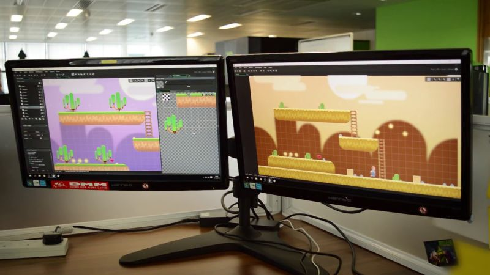
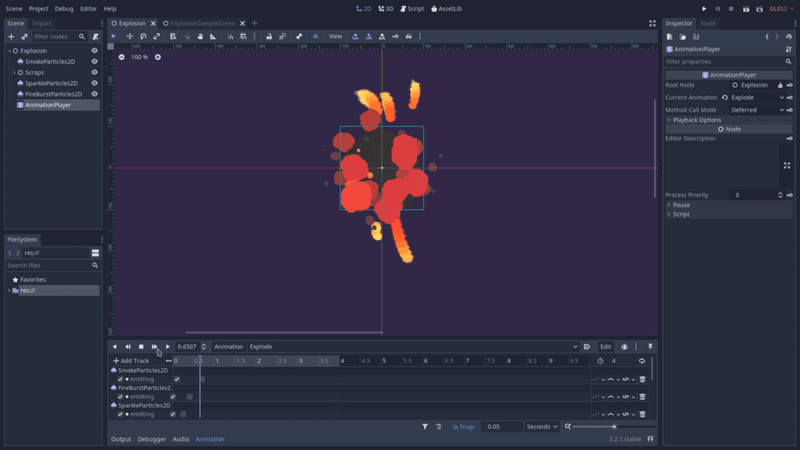
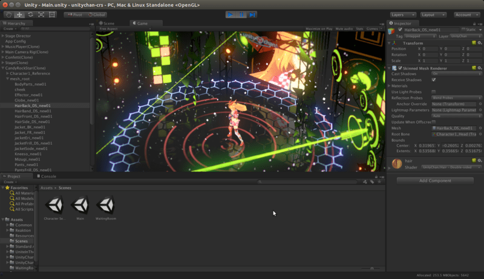

+++
title = "Game Engine Basics"

description = "What are game engines and what are the important factors to consider when browsing for game engines on the market."
author = "razvan"
coAutors = ["nathan"]

date = 2020-08-15T21:52:08+03:00
weight = 2
draft = true
+++

In this guide, you will get an introduction to game engines.

You will learn:

- What game engines are.
- What they do.
- How to choose the right game engine _for you_.


If you're a developer already and you know about game engines, we have [a more advanced guide]() about choosing your game engine.


## What's a game engine?

A game engine is a full-featured application or framework for creating games. Their purpose is to make game developers' life easier by automating repetitive tasks that appear in most game projects, like drawing images on the screen or playing audio.

These days, we take for granted that an engine should manage:

- User input
- Animation
- Audio
- Navigation
- Internationalization
- Graphical User Interfaces
- Networking
- Rendering
- Particle systems and visual effects
- Physics simulation
- Profiling and debugging
- Compile and exporting projects on multiple platforms

And more. These expectations came with the growth of general game engines like Unreal or Unity. A **general engine** allows you to create many types of games.

On the other hand, **specialized engines** are created and optimized for one game or one type of game. RPG Maker, a program designed to develop 2D Japanese RPGs, is a well-known example. Popular indie games like Super Meat Boy or Northgard also run on dedicated engines.

Game engines come in many flavors. Some offer a complete editor while others only provide code that you build from.

Editors allow you to create game levels visually. You import assets like images, 3D models, or audio files and place them in the editor's viewport. The actual engine is the code that takes all these levels and runs your game.

Some game engines come with a complete editor: Unreal, Unity, Godot, Game Maker, Construct. Others like Panda3D or Phaser only provide code. This isn't to say that one type is better than the other. Every development team has different needs, and they should assess the tools they use on a per-project basis.

## Pros and cons of using an engine

Using a game engine has advantages and disadvantages.

Some pros are that:

- You can focus on game content rather than technicalities.
- You don't have to learn to build everything from the ground up, like drawing pixels on the screen or playing audio.
- With an editor, it's easier for non-coders to participate in the development process.
- Engines can provide a plug-in <abbr title="Application Programming Interface">API</abbr> for third-parties to integrate their tools and make them available to others. You can find many specialized editors for different types of games on Unity's asset store.

Here are some cons:

- It's harder to control performances since you rely on complex software written by someone else. In the case of open-source projects, even though you have access to the code, the codebase can be too complicated to adapt it to your needs.
- You have to adapt to the engine's workflow and the way it works.
- You also have to work with its quirks and weaknesses.

Of course, these depend a lot on your current skills. If you have no programming experience, creating an engine might not even be an option. You'll want to [learn to code]() first and maybe gain some experience coding small programs and games to get your feet wet first.

## How does a game engine work?

A game engine is built out of many parts or modules, each with a specific role. Some of the more obvious ones are:

- Audio engine
- Physics engine
- Graphical User Interface
- 2D or 3D Rendering
- Animation
- Networking
- Artificial Intelligence

On top of the modules, general engines have systems that organize the interaction between these different parts. Most modern game engines run some of these modules in parallel to improve performance. 

Parallel execution increases code complexity a lot. The rendering code and performance implications of transferring information from the processor (CPU) to the graphics card (GPU) also add complexity, especially for 3D. For this reason and many more, most game developers opt for available game engines on the market instead of creating theirs from scratch.

Most general engines allow you to code your game using a scripting programming language along with built-in components. You can import assets and resources from 3D modeling applications, audio creation tools, image editors, and much more. The editor then allows you to organize and use your assets in your code.

Most general engines offer a plug-in architecture, allowing you to customize the editor itself, leading to a personalized experience. Some even allow you to customize rendering by tapping into the video rendering pipeline with modern video cards.

They also help you export games for your target platforms, such as Windows, Linux, macOS, Android, iOS, and consoles. We can't underestimate the importance of having an export manager as many complexities come with cross-platform support.

This scratches the surface of what general engines can do for you, but that hopefully gives you a sense of the tools they provide.

## Can I make my dream game now?

Making games isn't an easy task, but answering this question is a bit more complicated. You have instances of highly popular simple games like Flappy Birds, but these are mostly exceptions. Even with these, you need to understand programming, visual design, and audio.



One of the first questions you want to answer is which first game engine you should pick. One of the more critical aspects is its user-friendliness. Documentation and community support matter more than high performances at first. Regardless of the tool you choose, you'll have to learn the basics of game development. These skills are transferable to other game engines.

With that in mind, we recommend looking into the [Godot game engine](https://godotengine.org/) among your picks.

Godot is a fully featured beginner-friendly general game engine, packed in a small executable, capable of making both 2D and 3D games. It's well worth exploring what it has to offer.

It has mature documentation, although it's a bit unorganized at the moment. The community is friendly and helpful, and Godot is a developer-friendly game engine.

To get you started, we wrote a complete [beginner learning path](). It only contains free resources.

We also sell [in-depth courses](https://gdquest.mavenseed.com) to help you get beyond the initial steps.

If you'd like to support our work, we are on Kickstarter to crowdfund [Godot 2D Secrets](https://www.kickstarter.com/projects/gdquest/godot-2d-secrets-level-up-your-game-creation-skills), a comprehensive course to help you level up your game creation skills. All the details are on the Kickstarter campaign page.
