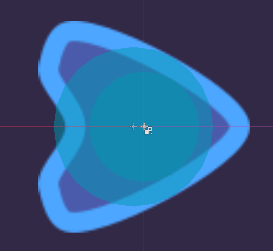
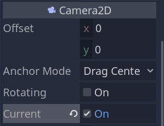
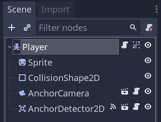

+++
title = "Anchor the camera from the player to fixed points"
description = "Learn to anchor the camera from the player to specific points of the screen with potentially  different zoom levels and in a smooth movement."
author = "raformatico"
coAuthors = ["nathan"]

date = 2020-10-25
weight = 5

difficulty = "beginner"
keywords = ["godot camera anchor"]

+++

Your ship advances through the space and the game camera follows it, but when it enters in a specific area it faces the final boss of your game. The camera should change its anchor position to warn the player but also to make easier the final fight. How can you do that?



In this tutorial you will be able to answer this question, you will learn to:

* Change the anchor and the zoom of the camera when the player enters in a specific part of the map.
* Interpolate the camera position from the player to different anchor points and vice versa.

You can find the full project [here](https://github.com/GDQuest/godot-mini-tuts-demos/tree/master/2d/anchor-camera).

## Main components

The main components to achieve this effect are the followings:

**1. _Anchor2D_: Camera anchor area** [here](#creating-a-camera-anchor-area)

This extends an _Area2D_ node instantiated in the game scene. If the player enters in this area the camera should change its anchor point to the center of the anchor area (_Anchor2D_). This node also has a property which indicates the _zoom_level_ of the camera in the area.

**2. _AnchorDetector2D_: Area to detect when the player enters in an anchor area** [here](#camera-to-change-its-zoom-and-anchor-point)

The player has this _Area2D_ node as a child. It is intended to detect when the player enters or goes out in an _Anchor2D_. It should notify through signals these events to the _AnchorCamera2D_.

**3. _AnchorCamera2D_: Camera to change its zoom and anchor point** [here](#camera-to-change-its-zoom-and-anchor-point)

_Camera2D_ node which is a child of the player. This node is in charge of changing the camera anchor and zoom level in function of the received signals from the player. It presents methods to do so in a smooth way.

**4. _Player_: Player to test the camera** [here](#creating-the-player-scene)

_KinematicBody2D_ node which plays the role of the player of this demo. It has _AnchorDetector2D_ and _AnchorCamera2D_ as their children.

### Collision layers

Bellow, you will see we have in the _Project -> Project Settings -> 2D Physics_ three 2D physics layers defined: _actors_, _obstacles_ and _anchors_. 


These layers will make easier managing the collisions as the _AnchorDetector2D_ will only detects areas in anchors' layer.

## Creating a camera anchor area

First, we need to create a new scene with a root _Area2D_ node named _Anchor2D_. Add a _CollisionShape2D_ child node and optionally a _Sprite_ with a texture to show the size of the anchor area in the game.


Define the size of the _CollsionShape2D_ to 1920 pixels wide and 1080 pixels height. As the _Extents_ property represents half the size of the shape, we set it to 960x540:


The purpose of this area is to be detected by other areas, therefore in the _Inspector_ of the _Anchor2D_ we enable monitorable and disable monitoring checkboxes. It does not scan any layer (no mask bit enabled) and its 2D physic layer is the third one: _anchors_.


Attach a new script to _Anchor2D_ with the following code:

```gdscript
class_name Anchor2D
extends Area2D

# The camera's zoom level to be set entering in this area.
export var zoom_level := 1.0
```

## Area to detect the entrance in an _Anchor2D_

Secondly, we need to create a new scene with another _Area2D_ node as root, this time name it _AnchorDetector2D_ as it will be the area in charge of detecting _Anchor2D_ nodes. Add a _CollisionShape2D_ node as child.


The size of the _CollisionShape2D_ should be a little smaller than the _CollisionShape2D_ of the player we will be attaching this _AnchorDetector2D_.



To be able to detect _Anchor2D_ nodes in the _Inspector_ set the following properties:


Connect the signals _area_entered_ and _area_exited_ of the _AnchorDetector2D_ to detect when it enters or leaves an _Anchor2D_ (third physic 2D layer associated with anchors).


When the node enters or leaves an _Anchor2D_ it will emit the signal _anchor_detected_ or _anchor_detached_ respectively that will be received by the _AnchorCamera2D_. Attach a script with the following code to do so:

```gdscript
class_name AnchorDetector2D
extends Area2D

# Signal to emit when entering in a `Anchor2D`. It should be received in `AnchorCamera2D`.
signal anchor_detected(anchor)
# Signal to emit when the detector stop being inside of any `Anchor2D`. It should be received in 
# `AnchorCamera2D`.
signal anchor_detached


# Emit the signal `anchor_detected` when entering in an `Anchor2D`. Send the `Anchor2D` as 
# an argument
func _on_area_entered(area: Anchor2D) -> void:
	emit_signal("anchor_detected", area)


# Emit the signal `anchor_detached` when exiting an `Anchor2D` and if there is no other 
# `Anchor2D` overlapping with us.
func _on_area_exited(area: Anchor2D) -> void:
	var areas: Array = get_overlapping_areas()
	if get_overlapping_areas().size() == 1 and area == areas[0]:
		emit_signal("anchor_detached")
```

## Camera to change its zoom and anchor point

Thirdly, create a new scene with a _Camera2D_ node as root and name it _AnchorCamera2D_. In the _Inspector_, set the camera node as _Current_ so Godot uses it as our game's camera.



Attach a script to the _AnchorCamera2D_ with the following code:

```gdscript
class_name AnchorCamera2D
extends Camera2D

# Radius in wich decrease the movement speed of the camera.
const SLOW_RADIUS := 300.0

# Maximum speed of the camera's movement.
export var max_speed := 2000.0

# Current velocity to move the camera.
var _velocity = Vector2.ZERO
# The camera's center.
var _anchor_position := Vector2.ZERO
# The camera's target zoom.
var _target_zoom := 1.0


func _ready() -> void:
	# The movement of the camera should be indenpent of its parent.
	set_as_toplevel(true)


func _physics_process(delta: float) -> void:
	update_zoom()

	# Camera's anchor point: the player position or the anchor if we are inside of one.
	var target_position: Vector2 = (
		owner.global_position
		if _anchor_position.is_equal_approx(Vector2.ZERO)
		else _anchor_position
	)
	arrive_to(target_position)


# Entering in an `Anchor2D` we receive the anchor object and change our `_anchor_position` and 
# `_target_zoom`
func _on_AnchorDetector2D_anchor_detected(anchor: Anchor2D) -> void:
	_anchor_position = anchor.global_position
	_target_zoom = anchor.zoom_level


# Leaving the anchor the zoom return to 1.0 and the camera's center to the player
func _on_AnchorDetector2D_anchor_detached() -> void:
	_anchor_position = Vector2.ZERO
	_target_zoom = 1.0


# Method to update the zoom in a smooth way.
func update_zoom() -> void:
	if not is_equal_approx(zoom.x, _target_zoom):
		# We make a linear interpolation between the current and the target zoom. The weight used
		# considere the delta value to make it independent of the frame rate
		var new_zoom_level: float = lerp(
			zoom.x, _target_zoom, 1.0 - pow(0.008, get_physics_process_delta_time())
		)
		# Update the new value of zoom
		zoom = Vector2(new_zoom_level, new_zoom_level)


# Method to gradually steer the camera center to a new point.
func arrive_to(target_position: Vector2) -> void:
	var distance_to_target := position.distance_to(target_position)
	# We approach the new camera's center at maximum speed (considering the zoom) until we are 
	# closer to the target point than the `SLOW_RADIUS`. Then we reduce this speed multiplying it
	# by a factor in function of the distance to the target
	_velocity = (target_position - position).normalized() * max_speed * zoom.x
	if distance_to_target < SLOW_RADIUS * zoom.x:
		_velocity *= (distance_to_target / (SLOW_RADIUS * zoom.x))
	
	# Update the new camera's center using the calculated velocity and delta
	position += _velocity * get_physics_process_delta_time()
```

As we will show in the next section, this camera node will be instantiated as child of the player and the signals _anchor_detected_ and _anchor_detached_ will be connected to the methods _\_on_AnchorDetector2D_anchor_detected_ and _\_on_AnchorDetector2D_anchor_detached_.

## Creating the Player scene

We designed a player-controlled ship to test our camera for this small demo. It's a `KinematicBody2D` node with the following code attached to it:

```gdscript
# Ship that rotates and moves forward, similar to classics like Asteroid.
class_name Player
extends KinematicBody2D

export var speed := 520
export var angular_speed := 3.0


func _physics_process(delta):
	# Calculation of the direction to rotate.
	var direction := Input.get_action_strength("right") - Input.get_action_strength("left")
	var velocity = Input.get_action_strength("move") * transform.x * speed
	rotation += direction * angular_speed * delta
	move_and_slide(velocity)
```

To get the camera centered in the _Player_, the _AnchorCamera2D_ should be a child of our _Player_ and to detect _Anchor2D_ nodes to change the camera anchor we also instantiate _AnchorDetector2D_.



To communicate the _AnchorDetector2D_ with the _AnchorCamera2D_ we connect the signals _anchor_detected_ and _anchor_detached_ from _AnchorDetector2D_ with the methods _on_AnchorDetector2D_anchor_detected_ and _on_AnchorDetector2D_anchor_detached_ in _AnchorCamera2D_.


### Input actions

Finally, to control the movement of the player we defined in the _Project -> Project Settings... -> Input Map_ the following input actions: _right_, _left_ and _move_.


