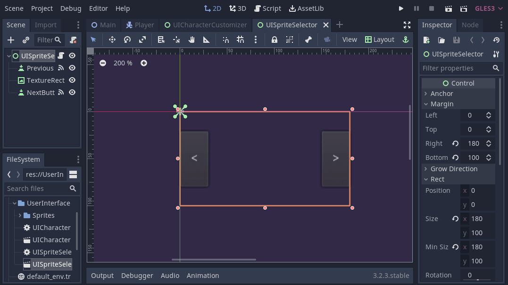
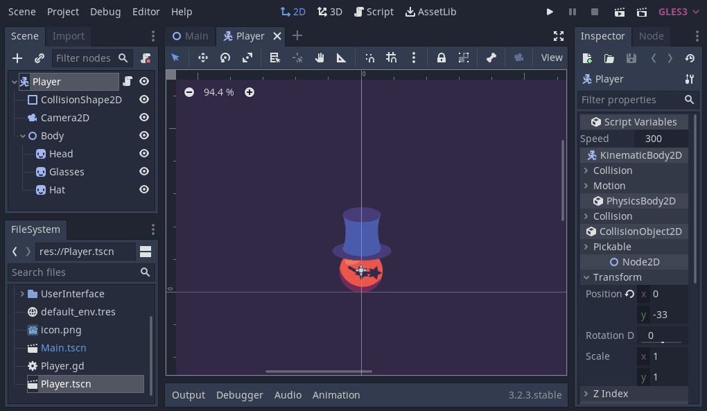

+++
title = "Character Customization"
description = "Learn how to customize your character in-game."
author = "azagaya"

date = 2020-09-30T19:22:42-03:00
weight = 5
draft = true

difficulty = "beginner"
keywords = ["customization"]
+++

In this tutorial, you will learn how to customize a character through a GUI and see the results in real-time. In the end, you will be able to customize the __hat__, the __head__ and the __sunglasses__ of the character.



You can download the full project of this tutorial [here](https://github.com/GDQuest/godot-mini-tuts-demos/tree/master/2d/character-customization).

For selecting the desired textures for each part of the character, we will make a GUI that lets the user choose between the different options. As the code for changing any of the parts is the same, we are going to make a single scene with the functions to cycle between the available textures. Then we are going to use three instances of that scene to build the final GUI.

## Sprite Selector Scene

Start by creating a new scene, with a `Control` node as root, and name it _UISpriteSelector_. Add to the scene two `Button` nodes, and a `TextureRec`. Name the buttons _PreviousButton_ and _Next Button_. They will be used to cycle between the possible textures, and the `TextureRect` will display the currently selected one. Arrange the scene so it looks like this:



Attach the following script to the newly created _UISpriteSelector_ scene.

```gd
class_name UISpriteSelector
extends Control
# Scene with the necessary controls to select a texture for the customization

# Emitted every time the selected texture changes
signal sprite_changed(texture)
# We store all possible textures in the _sprites array, and the index of the 
# currently selected one in _index
var _sprites := []
# Every time we change the `_index` value, we also want to update the texture.
# Using a setter function makes this relationship more explicit.
var _index := 0 setget _set_index

onready var texture_rect: TextureRect = $TextureRect

# We define a setup function to fill the `_sprites` array with the corresponding
# textures, and to select the first one by default
func setup(sprite_textures: Array) -> void:
	_sprites = sprite_textures
	_set_index(0)


# Connect this functions to the pressed signal of the corresponding buttons
# to select next or previous texture.
func _on_PreviousButton_pressed() -> void:
	_set_index(_index - 1)


func _on_NextButton_pressed() -> void:
	_set_index(_index + 1)


# We use this function to update the _index value, and the selected texture
func _set_index(value: int) -> void:
	# We use wrapi function to cycle through the values between `0` and
    # `_sprites.size()-1`.
	_index = wrapi(value, 0, _sprites.size())
	var texture: StreamTexture = _sprites[_index]
	# Update the texture, to show the selected one
	texture_rect.texture = texture
	emit_signal("sprite_changed", texture)

```

## Character Customizer Scene

We can use the _UISpriteSelector_ scene created previously to build a GUI that allows the user to customize the character. Create a new scene with a `Control` as a root node. Name it _UICharacterCustomizer_. After that, add a `Panel` node to the scene. We are going to use it as a background for the GUI. Add also a `VBoxContainer` as a child of the `Panel`. We will add the _UISpriteSelector_ instances as children of this container, so they automatically arrange as rows. Your scene should look like this:


In the image above, we placed the scene in the top-left corner, because we want to have the customization controls there.

Let's attach a new script to this scene.

```gd
extends Control
# This script builds the character customizer GUI, with a `UISpriteSelector`
# for each customizable part.

# Emitted every time the user changed the hat texture
signal hat_changed(texture)
# Same as above, but for the head texture
signal head_changed(texture)
# Same as above, but for the glasses texture
signal glasses_changed(texture)

# `DATA` dictionary contains the possible textures of each part of the
# character. Each key of the dictionary represents a customizable part.
const DATA := {
	"hat" :
	[
		preload("Sprites/hat1.png"),
		preload("Sprites/hat2.png"),
		preload("Sprites/hat3.png")
		],
	"glasses" : [
		preload("Sprites/sun-glasses1.png"),
		preload("Sprites/sun-glasses2.png"),
		preload("Sprites/sun-glasses3.png")
		],
	"head": [
		preload("Sprites/head1.png"),
		preload("Sprites/head2.png"),
		preload("Sprites/head3.png") ]
	}

const sprite_selector_scene: PackedScene = preload("UISpriteSelector.tscn")

onready var vbox_container: VBoxContainer = $Panel/VBoxContainer


func _ready() -> void:
	# We need an instance of `UISpriteSelector` for each customizable part
	for key in DATA:
        # Get the textures available for the current `key`
		var textures: Array = DATA[key]
		var sprite_selector: UISpriteSelector = sprite_selector_scene.instance()
		vbox_container.add_child(sprite_selector)
		# After adding the `sprite_selector`, we add the corresponding textures
		# using `setup()` function
		sprite_selector.setup(textures)
		# Connect the `sprite_changed` signal of the `sprite_selector` to the
		# `_on_SpriteSelector_sprite_changed` fucntion, and pass `key` as an
		# extra parameter, to know which texture changed.
		sprite_selector.connect("sprite_changed", self, "_on_SpriteSelector_sprite_changed", [key])


func _on_SpriteSelector_sprite_changed(texture: StreamTexture, key: String) -> void:
	# When a texture changes, we emit the corresponding signal, to notify the 
	# character in the main scene.
	emit_signal(key + "_changed", texture)

```

When calling the `emit_signal()` function, we use `key+"_changed` because `key` contains the name of the part that was changed. For instance, if a __hat__ changes, `key` should be equal to `"hat"`, and thus, `hat_changed` would be emitted. The `texture` parameter of this function comes from the signal defined in the _UISpriteSelector_.

## Character

The only remaining task is making a character to customize. Create a new scene, with a `KinematicBody2D` node as root, and name it _Player_. This character should have a sprite for each customizable part. In this case, we are going to have three sprites, named _Head_, _Glasses_, and _Hat_. Build the scene like in the following image.



We placed all `Sprite` nodes as children of a `Node2D` called _Body_. With this, we can flip them all at once by flipping _Body_.

Attach a script to the _Player_ scene.

```gd
extends KinematicBody2D
# Character script with some basic movement, and the functions needed to update
# the sprites of the customizable parts.
export var speed := 300.0

onready var body := $Body
# We store references to each customizable sprite, for later use
onready var hat := $Body/Hat
onready var glasses := $Body/Glasses
onready var head := $Body/Head


# Basic movement is handled here, just for demonstration purposes.
func _physics_process(_delta) -> void:
	var direction := Vector2(
		Input.get_action_strength("ui_right") - Input.get_action_strength("ui_left"),
		Input.get_action_strength("ui_down") - Input.get_action_strength("ui_up")
	).normalized()

	move_and_slide(direction * speed)

	if direction.x != 0:
		body.scale.x = sign(direction.x)

# This functions changes the `glasses.texture`. Needs to be connected to the
# `glasses_changed` signal of the `UICharacterCustomizer`
func _on_CharacterCustomizer_glasses_changed(texture) -> void:
	glasses.texture = texture


# Same as previous funciton, but for the `hat`.
func _on_CharacterCustomizer_hat_changed(texture) -> void:
	hat.texture = texture


# Same as previous function, but for the `head`.
func _on_CharacterCustomizer_head_changed(texture) -> void:
	head.texture = texture
```

In the main scene, we are going to connect the signals emitted from the _UICharacterCustomizer_ scene to the three functions defined above.

## Main Scene

Make a new scene from a `Node2D`, and name it _Main_. Add the _Player_ and a `CanvasLayer` to it. Then, add the _UICharacterCustomizer_ scene to the `CanvasLayer` node. This will make the GUI stay fixed in relation to the screen.


Remember to connect the `hat_changed`, `head_changed` and `glasses_changed` signals from the _UICharacterCustomizer_, to the matching functions defined in the _Player_ script. This way, when the user changes some texture from the GUI, the character sprite will be updated as well.
