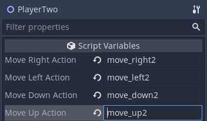

+++
title = "Local Multiplayer Input"
description = ""
author = "henrique"

date = 2020-07-25T10:25:59-03:00
weight = 5
draft = true

difficulty = "beginner"
keywords = ["multiplayer", "local", "input", "tutorial"]
+++

A common mistake that happens when coding the movement of a player is using constants for the inputs. For instance:

```
export var speed := 600.0
export var direction := Vector2.ZERO

var _velocity := Vector2.ZERO

func _process(delta: float) -> void:
  update_direction()
  _velocity = direction * speed
  translate(_velocity * delta)


func update_direction() -> void:
	direction.x = Input.get_action_strength("move_right") - Input.get_action_strength("move_left")
	direction.y = Input.get_action_strength("move_down") - Input.get_action_strength("move_up")
```

Note that all the `"move_*"` checks are constants. Here the `Player.gd` class always reacts to the same inputs. This leads to one player controlling both players characters:



In this mini-tutorial, you are going to learn a quick fix to that.

## Use variables!

The problem with using constants is that we can't change the reference to input actions. This prevents us from checking for different inputs on instances of the `Player.gd` class.

To solve that we need to check for variables instead. We can export the input variables to be able to set them through the Editor.

```
export var move_right_action := "move_right"
export var move_left_action := "move_left"
export var move_down_action := "move_down"
export var move_up_action := "move_up"
```

Then in the `update_direction()` method we check for these variables instead of constants:

```
func update_actor_direction() -> void:
	_actor.direction.x = Input.get_action_strength(move_right_action) - Input.get_action_strength(move_left_action)
	_actor.direction.y = Input.get_action_strength(move_down_action) - Input.get_action_strength(move_up_action)
```

## Player 2 controls

From there, we can create the Player 2 controls in the _Project > Project Settings > Input Map_. In our demo project, we appended the suffix `2` to differ on Player 2's actions, but yyetname them as you want.


The important part is to create an instance of the `Player.tscn` scene and match the Player 2's input inside it.



With that we have independent players characters. Note that you can extend this approach to any number of local players. For that you need to set their actions in the _Input Map_ and match them on their characters instance.



Note that we used movement direction as an example, but the same approach works for jump, shoot, hold, throw, and any other player action.
