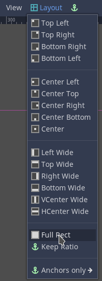

+++
title = "Scene Transitions"
description = "Learn how to make smooth scene transitions in Godot"
author = "henrique"

date = 2020-07-22T16:10:18-03:00
weight = 5
draft = true

difficulty = "beginner"
keywords = ["transition", "scene change", "load scene", "tutorial"]
+++

_Scenes_ are the building blocks of game development with Godot Engine, they can be simple props, whole levels, and even the whole game world. It's common to have each level or screen saved as an individual _PackedScene_ and use the [`SceneTree.change_to`](https://docs.godotengine.org/en/stable/classes/class_scenetree.html#class-scenetree-method-change-scene) method to transit between them. Here goes a quick tip to prevent breaking immersion when transitioning between scenes: make transitions!



To make transitions we need to cover the whole screen and animate the transparency like a fade effect. In that sense, nothing better than a [_ColorRect_](https://docs.godotengine.org/en/stable/classes/class_colorrect.html) node. The idea here is that we can browse a _PackedScene_ in the project and perform a smooth fading transition to it. The _ColorRect_ should also fade in as soon as it is ready to prevent the scenes to pop on the screen.

## Fading Animation

Hands-on the project now. Create a new scene and add a _ColorRect_ as root. Rename it as _SceneTransitionRect_. On the Layout menu, select the "Full Rect" option.



With this layout, we ensure the _SceneTransitionRect_ covers the whole screen. You can change the _Color_ property to any color you like, but for fading purposes, _Black_ goes well.

Now for the fading animation let's add an [_AnimationPlayer_](https://docs.godotengine.org/en/stable/classes/class_animationplayer.html) as a child of the _SceneTransitionRect_ and create a new animation, let's name it _Fade_ and set its duration to `0.5`. Something important to note is that since the _SceneTransitionRect_ fades in and out the total duration of the effect is twice the animation duration, in that case, `1.0` second.

In this animation, the _SceneTransitionRect_ starts completely transparent then it becomes opaque at the end. For that, set the alpha value of the _Modulate_ property's color to `0.0` and add a keyframe. Then move the animation's cursor to the end at `0.5` second and set the _SceneTransitionRect > Modulate_ alpha back to `255`, i.e. opaque, add a new keyframe.


## Fixing mouse click issues

If your game doesn't have mouse events you can skip this section, otherwise, before we move on to the actual transition we need to prevent that the _SceneTransitionRect_ consume mouse events. Since it covers all the screen and should be on top of every other node in the scene hierarchy, it will consume mouse inputs by default.

In the _SceneTransitionRect > Mouse_ category change the _Filter_ property to "Ignore". This should fix this issue. Now let's move on to the actual transition.

## Transition

It's time to code! Attach a new script to the _SceneTransitionRect_ and let's start by exporting a _String_ variable with some export hints to allow us to browse the file system and search for _PackedScene_ files. Let's also set up a reference for the _AnimationPlayer_.

```
extends ColorRect

# Path to the next scene to transit to
export(String, FILE, "*.tscn") var next_scene_path

# Reference to the _AnimationPlayer_ node
onready var _anim_player := $AnimationPlayer
```

Since we want the _SceneTransitionRect_ to fade in when it gets ready, we can perform the _Fade_ animation on the `_ready()` callback and play it backward, this way it is going to start opaque and then become transparent.

```
func _ready() -> void:
	# Plays the animation backward to fade in
	_anim_player.play_backwards("Fade")
```

Now it's time to code the actual transition. The logic is that the _SceneTransitionRect_ fades out completely and then it loads the next scene. By default, it should transit to the `next_scene_path` but we can pass a different _PackedScene_ path as an argument.

```
func transit(to := next_scene_path) -> void:
	# Plays the Fade animation and wait until it finishes
	_anim_player.play("Fade")
	yield(_anim_player, "animation_finished")
	# Changes the scene
	get_tree().change_scene(to)
```

## Using the SceneTrantionRect

Let's see a use case for this node we created. Let's say you have a main menu with three buttons that should load different scenes:

- Start
- Options
- Credits

You can attach a script to the topmost node and connect each button `pressed` signal to a callback:

```
onready var _transition_rect := $SceneTransitionRect

func _on_StartButton_pressed() -> void:
  _transition_rect.transit("res://path/to/Play.tscn")


func _on_OptionsButton_pressed() -> void:
  _transition_rect.transit("res://path/to/Options.tscn")


func _on_CreditsButton_pressed() -> void:
  _transition_rect.transit("res://path/to/Credits.tscn")
```

### Demo scene

In our project demo scene, we used what we called a _SceneButton_, a simple button that exports a variable to browse a _PackedScene_ path in the file system, like the `SceneTransitionRect.next_scene_path`. It has a custom signal that notifies when a `scene_prompted` and it passes the path to that scene. Then we connected that signal to the `SceneTransitionRect.transit()` method.
