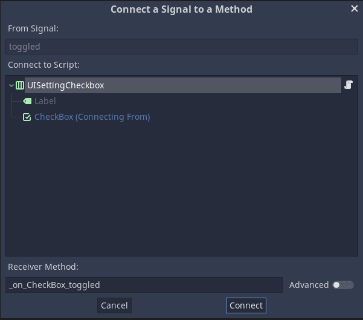
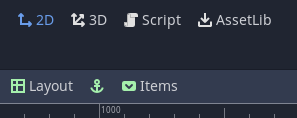
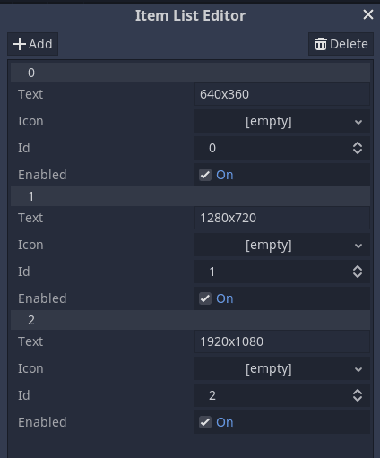

+++
title = "Video Settings Demo"
description = "Create a interface to edit video settings in run-time."
author = "azagaya"

date = 2020-10-13T17:56:45-03:00
weight = 5
draft = true

difficulty = "beginner"
keywords = ["settings"]
+++

In this tutorial, you will learn how to edit video settings in run-time. By the end, you will be able to change the **resolution** of the game, toggle **vsync**, and choose between **fullscreen** and windowed mode.

 

You can download the full project [here](https://github.com/GDQuest/godot-mini-tuts-demos/tree/master/2d/settings-demo).

**Vsync** and **fullscreen** options have only two possible values: on and off. So, a checkbox is enough for these settings. We can make a scene with a checkbox that emits a signal when toggled, and reuse this scene for both settings later.

## Creating a widget for configuring **vsync** and **fullscreen**

Create a new scene with an `HBoxContainer` node as root, and name it _UISettingCheckbox_. Add a `CheckBox` and a `Label` to it. We'll use the label to identify the setting controlled by the `CheckBox`. Your scene tree should look like this:


Attach a new script to the _UISettingCheckbox_ scene.

We should connect the checkbox's `toggled` signal to the _UISettingCheckbox_. Select the checkbox in the scene tree, head to the _Node_ dock, and double click _toggled_. Press the _Connect_ button in the window that pops up.



You should see the signal connected like this:


After that, complete the script as it's shown and explained below.

```gd
# Scene with a checkbox to switch settings with boolean values
tool
extends Control

# Emitted when the `CheckBox` state changes.
signal toggled(is_button_pressed)

# The text of the Label should be changed to identify the setting.
# Using a setter lets us change the text when the `title` variable changes.
export var title := "" setget set_title

# We store a reference to the Label node to update its text.
onready var label := $Label


# Emit the `toggled` signal when the `CheckBox` state changes.
func _on_CheckBox_toggled(button_pressed: bool) -> void:
	emit_signal("toggled", button_pressed)


# This function will be executed when `title` variable changes.
func set_title(value: String) -> void:
	title = value
	# Wait until the scene is ready if `label` is null.
	if not label:
		yield(self, "ready")
	# Update the label's text
	label.text = title
```

In the previous code, we used the `tool` keyword. This way, we can see the label's text updated when changing the editor's `title` variable.

In the `set_title()` function, we wait until the scene is ready if `label` happens to be `null` because `$Label` won't be available until the scene is ready. 

## Creating a widget to choose screen resolution

Now, let's create a scene that enables the user to choose the screen resolution from a list of predefined values. 

Create a new scene, with an `HBoxContainer` node as root, and name it _UIResolutionSelector_. Add a `Label` to the container, and change its text to "Resolution". Then, also add an `OptionButton` to the container.


Select the `OptionButton` node in the scene tree, and you'll notice that a button called "Items" appears in the toolbar. 



Press this button and add "640x360", "1280x720" and "1920x1080" items. This will make those options to be available in the `OptionButton`.



It's important to define the items as shown in the image above. Doing so lets us split the selected item's text to get the resolution in both dimensions.

Attach a new script to the scene, and connect the `item_selected` signal, as we did with the checkbox's `toggled` signal in the _UISettingCheckbox_ scene.

Here's the _UIResolutionSelector_'s code and how its work:

```gd
# Scene with an OptionButton to select the resolution from a list of options
extends Control

# Emitted when the selected resolution changes.
signal resolution_changed(new_resolution)

# We store a reference to the OptionButton to get the selected option later
onready var option_button: OptionButton = $OptionButton


func _update_selected_item(text: String) -> void:
	# The resolution options are written in the form "XRESxYRES".
	# Using `split_floats` we get an array with both values as floats.
	var values := text.split_floats("x")
	# Emit a signal for informing the newly selected resolution
	emit_signal("resolution_changed", Vector2(values[0], values[1]))


func _on_OptionButton_item_selected(_index: int) -> void:
	# Call the `_update_selected_item` function when the user selects
	# a new item in the `OptionButton`
	_update_selected_item(option_button.text)
```

## Creating the Video Settings widget

Let's create a new scene, with a `Panel` node as root. Add a `VBoxContainer` node to it. Add two _UISettingCheckbox_ instances as children of the newly added container, and name them _UIFullScreenCheckbox_ and _UIVsyncCheckbox_. For each instance, change the `title` attribute in the inspector to "Full Screen" and "VSync" respectively. Note how those instances' labels changed in the editor, thanks to the `tool` keyword. 

After that, add a _UIResolutionSelector_ instance also as a child of the container node.

Finally, add a `Button` to the container, name it _ApplyButton_, and change its text to "Apply". We are going to use this button to notify when the user wants to apply the selected settings.

These are the important nodes for this scene, but you can go ahead and make it prettier, as shown below.


Attach a script to the scene and connect the `resolution_changed` signal of the _UIResolutionSelector_ to the script, as we did earlier. We also need to connect the `toggled` signal of the two _UISettingCheckbox_ instances. After that, complete the script as it follows:

```gd
# User interface that allows the player to select game settings.
# To see how we update the actual window and rendering settings, see
# `Main.gd`.
extends Control

# Emitted when the user presses the "apply" button.
signal apply_button_pressed(settings)

# We store the selected settings in a dictionary
var _settings := {resolution = Vector2(640, 480), fullscreen = false, vsync = false}


# Emit the `apply_button_pressed` signal, when user presses the button.
func _on_ApplyButton_pressed() -> void:
	# Send the last selected settings with the signal
	emit_signal("apply_button_pressed", _settings)


# Store the resolution selected by the user. As this function is connected
# to the `resolution_changed` signal, this will be executed any time the
# users chooses a new resolution
func _on_UIResolutionSelector_resolution_changed(new_resolution: Vector2) -> void:
	_settings.resolution = new_resolution


# Store the fullscreen setting. This will be called any time the users toggles
# the UIFullScreenCheckbox
func _on_UIFullscreenCheckbox_toggled(is_button_pressed: bool) -> void:
	_settings.fullscreen = is_button_pressed


# Store the vsync seting. This will be called any time the users toggles
# the UIVSyncCheckbox
func _on_UIVsyncCheckbox_toggled(is_button_pressed: bool) -> void:
	_settings.vsync = is_button_pressed
```

## Creating the Main scene

Let's make a new scene, with a `Node2D` as the root node, and name it _Main_. Add a `CanvasLayer` to it, and add an instance of the _UIVideoSettings_ scene to the canvas layer.


As shown in the _UIVideoSettings.gd_ script, we defined an `apply_button_pressed` signal, with the settings dictionary as an argument. Attach a script to our main scene and connect the `apply_button_pressed` signal to it.

In this script, we update the game's video settings to those received from the `apply_button_signal`:

```gd
# Controls and updates the actual game settings this node receives from the
# user interface.
extends Node2D


# We use a dictionary to represent settings because we have few values for now. Also, when you
# have many more settings, you can replace it with an object without having to refactor the code
# too much, as in GDScript, you can access a dictionary's keys like you would access an object's
# member variables.
func update_settings(settings: Dictionary) -> void:
	OS.window_fullscreen = settings.fullscreen
	get_tree().set_screen_stretch(
		SceneTree.STRETCH_MODE_2D, SceneTree.STRETCH_ASPECT_KEEP, settings.resolution
	)
	OS.set_window_size(settings.resolution)
	OS.vsync_enabled = settings.vsync


# Call the `update_settings` function when the user presses the button
func _on_UIVideoSettings_apply_button_pressed(settings) -> void:
	update_settings(settings)
```

You can see in the code above we used `SceneTree.STRETCH_MODE_2D` and `SceneTree.STRETCH_ASPECT_KEEP`. If you want to know more about those options, you can check out this tutorial:



 The demo will start with the settings configured in the _Project Settings_. You could add the code necessary to start from the default values in the _UIVideoSettings_ scene, but this is beyond the scope of this tutorial. 