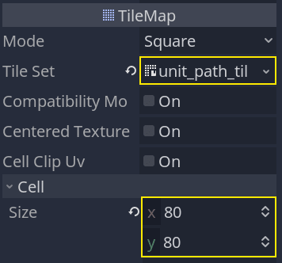

+++
title = "Drawing the path"
author = "nathan"
date = "2021-01-30"
description = "We write code to draw a path from a unit to the cursor interactively, as in games like Fire Emblem."
weight = 6
+++

We can now use our `PathFinder` to draw a preview of the path the player wants its unit to walk.

To do so, we'll use a _TileMap_ node with a script. We can leverage the _TileMap_'s autotile feature to draw a nice-looking path with rounded corners and an arrow at both ends.


If you don't like the double arrow, you can draw a sprite on top of the starting cell to cover it up.

In this demo, we'll generate a `PathFinder` on-the-fly every time the player selects a unit and use it to draw a preview of the path between the unit and the cursor. 

The reason is those cells can change every time you select a unit: they depend on the unit's position on the map and the position of the obstacles relative to it. In our case, the obstacles are other units.

Our units can walk a limited number of cells, so we don't have to worry about performance. Even on a low-end device, generating an AStar graph to walk a dozen cells should take a negligible amount of time. And finding a path itself is much cheaper.

In this lesson, we'll only to implement the path drawing. When working on the game board, we'll implement a flood fill algorithm to provide the `PathFinder` with an array of walkable cells.

## Creating and coding the UnitPath

Create a new scene with a _TileMap_ node named _UnitPath_. In the start project, you'll find a premade tileset, `unit_path_tileset.tres`. Assign it to the node's _TileSet_ property and set the _Cell -> Size_ to `80` by `80`.



The tileset itself has one autotile with a 3x3 bitmask that'll allow us to draw a smooth path.


Everything else happens in the code, where we use the `PathFinder` class we coded in the previous lesson. Save your scene and attach a new script to the _UnitPath_.

```gdscript
# Draws the unit's movement path using an autotile.
class_name UnitPath
extends TileMap

export var grid: Resource

# This variable holds a reference to a PathFinder object. We'll create a new one every time the 
# player select a unit.
var _pathfinder: PathFinder
# This property caches a path found by the _pathfinder above.
# We cache the path so we can reuse it from the game board. If the player decides to confirm unit
# movement with the cursor, we can pass the path to the unit's walk_along() function.
var current_path := PoolVector2Array()


# Creates a new PathFinder that uses the AStar algorithm we use to find a path between two cells 
# among the `walkable_cells`.
# We'll call this function every time the player selects a unit.
func initialize(walkable_cells: Array) -> void:
	_pathfinder = PathFinder.new(grid, walkable_cells)


# Finds and draws the path between `cell_start` and `cell_end`.
func draw(cell_start: Vector2, cell_end: Vector2) -> void:
	# We first clear any tiles on the tilemap, then let the Astar2D (PathFinder) find the
	# path for us.
	clear()
	current_path = _pathfinder.calculate_point_path(cell_start, cell_end)
	# And we draw a tile for every cell in the path.
	for cell in current_path:
		set_cellv(cell, 0)
	# The function below updates the auto-tiling. Without it, you wouldn't get the nice path with curves
	# and the arrows on either end.
	update_bitmask_region()


# Stops drawing, clearing the drawn path and the `_pathfinder`.
func stop() -> void:
	_pathfinder = null
	clear()
```

## Testing our path

To test the path drawing, we can write some temporary code in the _UnitPath_'s `_ready()` callback.

```gdscript
func _ready() -> void:
	# These two points define the start and the end of a rectangle of cells.
	var rect_start := Vector2(4, 4)
	var rect_end := Vector2(10, 8)

	# The following lines generate an array of points filling the rectangle from rect_start to rect_end.
	var points := []
	# In a for loop, writing a number or expression that evaluates to a number after the "in" 
	# keyword implicitly calls the range() function.
	# For example, "for x in 3" is a shorthand for "for x in range(3)".
	for x in rect_end.x - rect_start.x + 1:
		for y in rect_end.y - rect_start.y + 1:
			points.append(rect_start + Vector2(x, y))

	# We can use the points to generate our PathFinder and draw a path.
	initialize(points)
	draw(rect_start, Vector2(8, 7))
```

The `PathFinder` finds the path between `rect_start` and `Vector2(8, 7)` and allows us to draw it in the `draw()` function.


In the next lessons, we'll bring all the nodes together by coding the last piece of the puzzle: the _GameBoard_, that coordinates everything.
