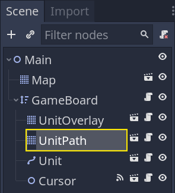
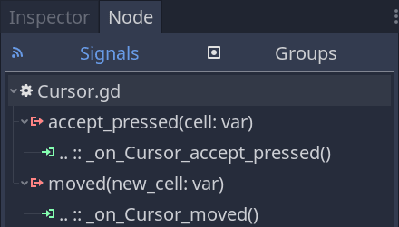
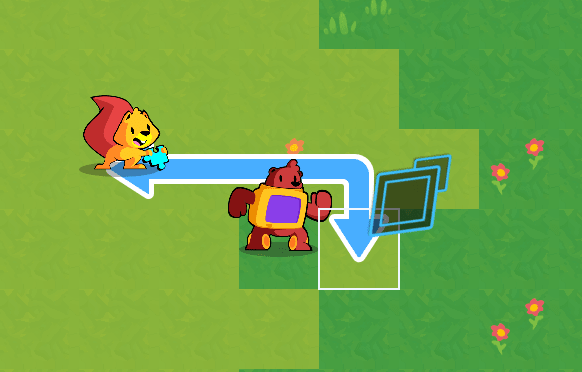

+++
title = "Unit selection and cursor interaction"
author = "nathan"
date = "2021-01-30"
description = "We add the ability to select units with the cursor and to move to a target cell."
weight = 8
+++

In this lesson, we'll work on the last piece of the puzzle: coordinating interactions between the cursor, the units, and the board.

Here are the interactions we want to allow:

1. If the cursor hovers a cell and it contains a unit, the player can select it.
1. When a unit is selected, pressing <kbd>Esc</kbd> deselects it.
1. When a unit is selected and the cursor hovers a different cell, pressing <kbd>Enter</kbd> or clicking the cell issues a move command.

Selecting a unit should also make the _UnitOverlay_ and _UnitPath_ nodes display information about where the unit can and will move.

We'll coordinate these actions with the _GameBoard_.

In the _Main_ scene, if you haven't already, you should first instantiate _UnitPath_ as a child of _GameBoard_.



Everything else will happen in `GameBoard.gd`. Open the script and let's start adding features.

We'll start with two properties to track the active unit and cache a reference to our _UnitPath_.

```gdscript
# The board is going to move one unit at a time. When we select a unit, we will save it as our
# `_active_unit` and populate the walkable cells below. This allows us to clear the unit, the
# overlay, and the interactive path drawing later on when the player decides to deselect it.
var _active_unit: Unit
# This is an array of all the cells the `_active_unit` can move to. We will populate the array when
# selecting a unit and use it in the `_move_active_unit()` function below.
var _walkable_cells := []

onready var _unit_path: UnitPath = $UnitPath
```

Then, let's add functions for the main commands we want to handle: select, move, and deselect. We have one function corresponding to each command, with an extra one to clear the properties we just defined, `_clear_active_unit()`.

```gdscript
# Selects the unit in the `cell` if there's one there.
# Sets it as the `_active_unit` and draws its walkable cells and interactive move path.
# The board reacts to the signals emitted by the cursor. And it does so by calling functions that
# select and move a unit.
func _select_unit(cell: Vector2) -> void:
	# Here's some optional defensive code: we return early from the function if the unit's not
	# registered in the `cell`.
	if not _units.has(cell):
		return

	# When selecting a unit, we turn on the overlay and path drawing. We could use signals on the
	# unit itself to do so, but that would split the logic between several files without a big
	# maintenance benefit and we'd need to pass extra data to the unit.
	# I decided to group everything in the GameBoard class because it keeps all the selection logic
	# in one place. I find it easy to keep track of what the class does this way.
	_active_unit = _units[cell]
	_active_unit.is_selected = true
	_walkable_cells = get_walkable_cells(_active_unit)
	_unit_overlay.draw(_walkable_cells)
	_unit_path.initialize(_walkable_cells)


# Deselects the active unit, clearing the cells overlay and interactive path drawing.
# We need it for the `_move_active_unit()` function below, and we'll use it again in a moment.
func _deselect_active_unit() -> void:
	_active_unit.is_selected = false
	_unit_overlay.clear()
	_unit_path.stop()


# Clears the reference to the _active_unit and the corresponding walkable cells.
# We need it for the `_move_active_unit()` function below.
func _clear_active_unit() -> void:
	_active_unit = null
	_walkable_cells.clear()


# Updates the _units dictionary with the target position for the unit and asks the _active_unit to
# walk to it.
func _move_active_unit(new_cell: Vector2) -> void:
	if is_occupied(new_cell) or not new_cell in _walkable_cells:
		return

	# When moving a unit, we need to update our `_units` dictionary. We instantly save it in the
	# target cell even if the unit itself will take time to walk there.
	# While it's walking, the player won't be able to issue new commands.
	_units.erase(_active_unit.cell)
	_units[new_cell] = _active_unit
	# We also deselect it, clearing up the overlay and path.
	_deselect_active_unit()
	# We then ask the unit to walk along the path stored in the UnitPath instance and wait until it
	# finished.
	_active_unit.walk_along(_unit_path.current_path)
	yield(_active_unit, "walk_finished")
	# Finally, we clear the `_active_unit`, which also clears the `_walkable_cells` array.
	_clear_active_unit()
```

And with the functions defined, we can implement the interactions.

For two of them, we need to connect our _Cursor_'s signals to the _GameBoard_. To do so, you can head back to the editor, select the _Cursor_, and in the _Node_ dock, connect both `moved` and `accept_pressed` to the _GameBoard_.



Back to `GameBoard.gd`, we can use the signal callbacks to select, move units, and update the _UnitPath_'s drawing.

```gdscript
# Updates the interactive path's drawing if there's an active and selected unit.
func _on_Cursor_moved(new_cell: Vector2) -> void:
	# When the cursor moves, and we already have an active unit selected, we want to update the
	# interactive path drawing.
	if _active_unit and _active_unit.is_selected:
		_unit_path.draw(_active_unit.cell, new_cell)


# Selects or moves a unit based on where the cursor is.
func _on_Cursor_accept_pressed(cell: Vector2) -> void:
	# The cursor's "accept_pressed" means that the player wants to interact with a cell. Depending
	# on the board's current state, this interaction means either that we want to select a unit all
	# that we want to give it a move order.
	if not _active_unit:
		_select_unit(cell)
	elif _active_unit.is_selected:
		_move_active_unit(cell)
```

All we're missing now is <kbd>Esc</kbd> to cancel the selection.

To do so, we can use the `_unhandled_input()` callback.

```gdscript
func _unhandled_input(event: InputEvent) -> void:
	if _active_unit and event.is_action_pressed("ui_cancel"):
		_deselect_active_unit()
		_clear_active_unit()
```

And with that, you should be able to select and move units. Also, you can place multiple units on the board. Just ensure they aren't on the same cell to avoid errors.



This concludes our free tactical RPG movement series with Godot.

**If you'd like to go further, check out our course [Godot 2D Secrets](https://gdquest.mavenseed.com/courses/godot-2d-secrets), from which it was open-sourced.**

It comes with longer tutorial series than this one, challenges to improve your game development skills, questions and answers, and lifetime free updates.

It also funds the hundreds of hours we spend creating free tutorials and open-source projects.

## The GameBoard code

Here's the complete _GameBoard_ script.

```gdscript
class_name GameBoard
extends Node2D

const DIRECTIONS = [Vector2.LEFT, Vector2.RIGHT, Vector2.UP, Vector2.DOWN]

export var grid: Resource = preload("res://Grid.tres")

var _units := {}
var _active_unit: Unit
var _walkable_cells := []

onready var _unit_overlay: UnitOverlay = $UnitOverlay
onready var _unit_path: UnitPath = $UnitPath


func _ready() -> void:
	_reinitialize()


func is_occupied(cell: Vector2) -> bool:
	return true if _units.has(cell) else false


func get_walkable_cells(unit: Unit) -> Array:
	return _flood_fill(unit.cell, unit.move_range)


func _reinitialize() -> void:
	_units.clear()

	for child in get_children():
		var unit := child as Unit
		if not unit:
			continue
		_units[unit.cell] = unit


func _flood_fill(cell: Vector2, max_distance: int) -> Array:
	var array := []
	var stack := [cell]
	while not stack.empty():
		var current = stack.pop_back()

		if not grid.is_within_bounds(current):
			continue
		if current in array:
			continue

		var difference: Vector2 = (current - cell).abs()
		var distance := int(difference.x + difference.y)
		if distance > max_distance:
			continue

		array.append(current)
		for direction in DIRECTIONS:
			var coordinates: Vector2 = current + direction
			if is_occupied(coordinates):
				continue
			if coordinates in array:
				continue

			stack.append(coordinates)
	return array


func _select_unit(cell: Vector2) -> void:
	if not _units.has(cell):
		return

	_active_unit = _units[cell]
	_active_unit.is_selected = true
	_walkable_cells = get_walkable_cells(_active_unit)
	_unit_overlay.draw(_walkable_cells)
	_unit_path.initialize(_walkable_cells)


func _deselect_active_unit() -> void:
	_active_unit.is_selected = false
	_unit_overlay.clear()
	_unit_path.stop()


func _clear_active_unit() -> void:
	_active_unit = null
	_walkable_cells.clear()


func _move_active_unit(new_cell: Vector2) -> void:
	if is_occupied(new_cell) or not new_cell in _walkable_cells:
		return

	_units.erase(_active_unit.cell)
	_units[new_cell] = _active_unit
	_deselect_active_unit()
	_active_unit.walk_along(_unit_path.current_path)
	yield(_active_unit, "walk_finished")
	_clear_active_unit()


func _on_Cursor_moved(new_cell: Vector2) -> void:
	if _active_unit and _active_unit.is_selected:
		_unit_path.draw(_active_unit.cell, new_cell)


func _on_Cursor_accept_pressed(cell: Vector2) -> void:
	if not _active_unit:
		_select_unit(cell)
	elif _active_unit.is_selected:
		_move_active_unit(cell)


func _unhandled_input(event: InputEvent) -> void:
	if _active_unit and event.is_action_pressed("ui_cancel"):
		_deselect_active_unit()
		_clear_active_unit()
```
