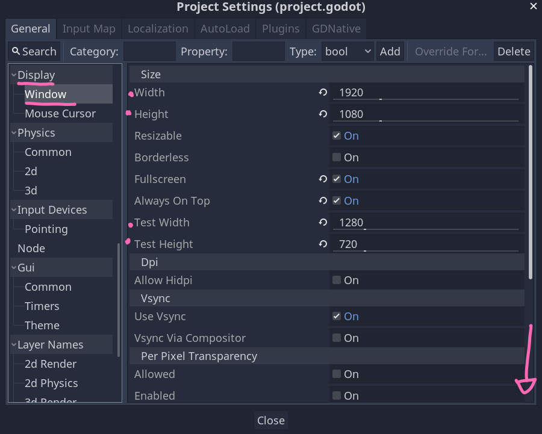

+++
title = "Player and Enemy"
author = "nathan"
date = "2020-06-20"
description = "Learn to code the player and enemy of our 2D game from scratch."

weight = 1

type = "video"
videoid = "Mc13Z2gboEk"
+++

## Errata

### Missing segment at 32:21

There is a missing segment at 32:21, where I changed the project's window settings. These settings control the resolution and the way the game window scales. Here's how to change them.

Go to the menu _Project -> Project Settings_.

In the left column, scroll down to _Display -> Window_, and click on _Window_ to open the window settings on the right side.

Here are the settings I changed. In the size section at the top. These settings control the resolution of the game and size of the window:

- Width: `1920`
- Height: `1080`
- Test Width: `1280`
- Test Height: `720`

Then, scroll down to the stretch section and set:

- Mode: _2d_
- Aspect: _expand_




These two settings will make the game viewport resize with the window. Without them, when you increase the window size, more of the game level would show. The expand aspect setting makes it so when you change the ratio of the window, it shows a little more or less of the game world to preserve the proportions of the game sprites. You can play with these settings to see the differences they make.

### Change in value at 1:02:26

At 1:02:26, the line 13 of Player.gd changes: the value `1.0` turns into `0.0`, but it's not mentioned in the video.

You should also change this value. The line should be:

```gd
-Input.get_action_strength("jump") if is_on_floor() and Input.is_action_just_pressed("jump") else 0.0
```
