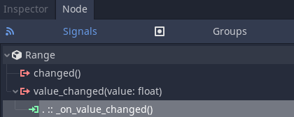

+++
title = "Volume Slider"
description = "Learn how to control audio volume through a slider interface"
author = "henrique"

date = 2020-07-18T10:12:43-03:00
weight = 5
draft = true

difficulty = "beginner"
keywords = ["godot audio", "godot music", "godot sound effects", "godot interface"]
+++

# Volume Sliders

When releasing a game you need to be aware that players have all kinds of preferences, they interact with your game in all sorts of ways with a range of equipment. Due to that your game sounds and music may need to adapt to what better player's preferences and that's nothing better for that than allow them to tweak these settings themselves.

A good interface to allow players to interact with the volume of your game sounds is a _Volume Slider_, a simple slider ranging from 0% to 100% which syncs its value with the audio's volume.

<video controls width="640">
   <source src="demo.mp4"
           type="video/mp4">
</video>

Godot Engine provides a node that is perfect for this interface widget, the _HSlider_. Let's create a new scene with an _HSlider_, rename it as _VolumeSlider_. Before we tweak its properties in the Inspector we need to understand that audio volume is measured in _dB_, short for decibels, and the dB scale is not linear so is hard to interact with it using a slider, especially from a player perspective which doesn't need to know how audio volume and decibels scales work.

Luckily Godot offers an easy way to convert dB values to linear values and vice versa. For that, we can use `db2linear` and `linear2db`. Using these methods when we convert a dB value to a linear scale we get a value ranging from `0.0` to `1.0` the same goes when converting a linear value to dB scale as we need to pass a value ranging from `0.0` to `1.0`. Any value above that range is an over-amplification, which can cause artifacts in the audio.

With that in mind, we need to set our _HSlider > Max Value_ to `1.0` and to be able to decently slide the value need to decrease the _Step_ to some lower value such as `0.05`


Now, let's attach a script to our _VolumeSlider_. The idea here is that we sync the _VolumeSlider > Value_ to an _Audio Bus_ volume. So we need to know which _Audio Bus_ it syncs to. For that, we can _export_ a `String` variable that represents the _Audio Bus_ name. You can access and manage audio buses on the _Audio_ tab at the bottom of the editor, from there you know the name of the _Audio Bus_ you want to sync. By default, the _VolumeSlider_ syncs to the _"Master"_ bus.

```
extends HSlider


export var audio_bus_name := "Master"

onready var _bus := AudioServer.get_bus_index(audio_bus_name)


func _ready() -> void:
	value = db2linear(AudioServer.get_bus_volume_db(_bus))


func _on_value_changed(value: float) -> void:
	AudioServer.set_bus_volume_db(_bus, linear2db(value))

```

Since we can only set the volume of an _Audio Bus_ using its index we need to retrieve its index by requesting it the _Audio Server_ to find the _Audio Bus_ index using the `audio_bus_name`. We can do that using an `onready` variable.

Right when the slider is _ready_ we sync its `value` to the _Audio Bus_ volume, of course converting the volume to linear.

We need to change the bus volume every time our _VolumeSlider_ value changes, so let's connect its _value_changed_ signal to itself, here we renamed the signal callback to `_on_value_changed`.



And there we have it, an easy way to allow players to interact with the game's audio. Now a quick tip, _Sliders_ in Godot don't lose focus automatically when we stop interacting with them and this can cause some unexpected behaviors. Connect the _mouse_exited_ signal directly to the builtin `release_focus` method to ensure that as soon as the mouse is out the _VolumeSlider_ it loses the focus and stop consuming inputs.


