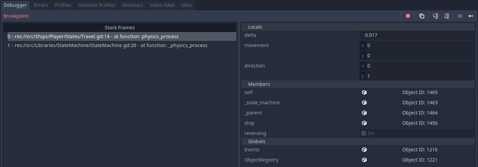
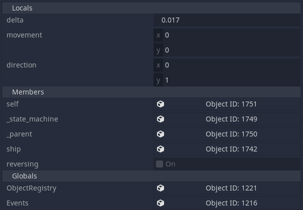
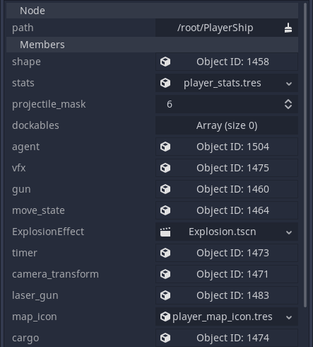

+++
title = "Getting started with debugging"
description = "Learn how to debug your project in Godot with the debugger"
author = "razoric"
programVersion = "3.2"

date = 2020-08-17T13:19:24-04:00
weight = 5
draft = true

difficulty = "beginner"
tags = ["tutorial", "godot", "gdscript"]
keywords = ["godot debugging tutorial", "gdscript debugging", "debug gdscript", "debug godot"]
+++

Does your code look like this?

```gdscript
func get_file_data(filepath):
    var file = File.new()

    var error = file.open(filepath, File.READ)

    print(error) # 1...

    var line_length = file.get_32()

    print(line_length) # 2...

    var lines = []

    for _i in line_length:
        lines.append(file.get_line())

        print(lines.front()) # n + 1...

    file.close()

    var data = _parse_data(lines)

    print(data) # and one more

    return data
```

Or as an even worse offender, does this?



It'd be a lot more efficient if you could make the program stop running so you could look at what's in those values directly, wouldn't it? Let's do that.

## Accessing the debugger

You access the debugger in one of two ways. The first is to open it with the _Debugger_ tab in the bottom toolbar.


The second is to pause the execution of your game by hitting a _Breakpoint_.

## Breakpoints

A breakpoint is a way to tell the client running the code to tell the debugger to pause the execution of the software and report to the programmer. The game pauses and the debugger shows where the breakpoint happened and fills its panel with information about the state of the game at the time.

You set breakpoints by opening the script you want to debug, navigating to the line you want to break at, and either pressing the F9 shortcut key (by default) or by clicking in the margin to the left of the line numbers. To show that it's set a breakpoint, a little red dot appears to the left of the line.


Godot's dot looks like a rectangle, but a red dot of some kind is a universal symbol across most debuggers.


Most of the time at least. Some code editors and themes break from the norm by choice or limitation.


With breakpoints set, once you run your game, it executes until it reaches the line of code. The execution stops right _before_ the line it broke on executes. The script editor highlights the line and a little green arrow is overlaid in the same spot as the breakpoints.


If you hover over any variable that you've set before the line of code, you can see a little hint box that shows the contents.


<p class="note">
You can hover over a variable that you have <i>not</i> set yet, but those variables often show whatever the debugger was looking at in RAM at the time, poorly translated into a value that may not make any sense.
</p>

To check a value or two that happen to be nearby, that's not a bad way to go about it. But when you want to dig through your code and check variables throughout the project, you need something more complete. That's where the debugger panel comes in.

## Parts of the debugger



In the top left, Godot lists why the program paused. Most of the time, that's `Breakpoint` because you set a breakpoint or paused the scene. If your code runs into an error, it shows the error text instead. For example, `Division by Zero in operator '/'.`


In the bottom left you have the Stack Frames (also named the call stack) panel. When the program pauses, it notes which function it paused on and makes it the first element. It marks the function that called it as the next element, and the function that called _that_ function is next, stacking on top of each other, hence the name. This goes on and on until you reach a point where you cannot dig any further. In Godot's case, this is going to be because the C++ engine called the function (like the built-in `_physics_process`).

If you click on any element in the list, you can go back and forth and see the execution state of each of those function calls. It can be useful if you want to see why you got certain parameters or which `if/else` block or `for` loop called the function.



On the bottom right, you have the Variables panel. The debugger lists all variables it can see in the current call stack frame and their values. Switching frames switches those variables to that stack frame's. It splits the variables into three categories: locals, members and globals.

-   Locals are variables that exist in the current function. Once the function is over, those variables no longer exist.
-   Members are variables that are part of the current class or the class it extends'.
-   Globals are variables that you've declared as Singletons in the project settings and are accessible everywhere.

Godot does _not_ put variables from its built-in classes, like Node or Object, in this panel to keep it from becoming crowded. For example, `Travel.gd` extends `Node`, which extends `Object`, but none of the `Node` or `Object` variables are in the members category. But you _can_ view those variables using the inspector.



On the right hand side of Godot is the inspector where you configure objects before running the game most of the time. Godot lists complex objects, like references to other Nodes, in the variables panel as buttons with the name `Object ID: ####`. The ID is an internal number the engine assigns objects to keep track of them. Clicking on this button sends that reference into the inspector where it lists every variable, even built-ins like `Node`'s. Every class has a member variable called `self` to refer to the current class. If you want to see the position of a class that extends Node2D, you can use the `self` button in the Members category to put it in the inspector.

You can click on more `Object ID` reference buttons in the inspector and keep drilling deeper into the game's memory until you find what you need.


It's not debugger specific, but the inspector's navigation buttons at the top right work while debugging too.


The final element of the debugger panel is the toolbar in the top right. The buttons there allow you to travel through the program by unpausing it one line at a time.

## Navigating through live code with the toolbar

The button on the left most is the `Skip Breakpoints` buttons. You can make the debugger ignore breakpoints temporarily without removing them. Next to that is the Copy Error button. If you have an exception, you can get a lot more information by copying the error message to paste elsewhere.

Now you reach the navigation buttons. You have the Step Into and the Step Over buttons. Take the following code as a example:

```gdscript
func _physics_process(delta: float) -> void:
	var movement := get_movement() #--Breakpoint here
    move_and_slide(movement * speed, Vector2.UP)


func get_movement() -> Vector2:
	return Vector2(
		Input.get_action_strength("right") - Input.get_action_strength("left"),
		Input.get_action_strength("thrust_back") - Input.get_action_strength("thrust_forwards")
	)
```

With a breakpoint set at the `var movement := get_movement()` line. If you press the _Step Into_ button (or use the shortcut key F11), Godot will go into the `get_movement()` function and pause at the first line. If you press the _Step Over_ button (or use the shortcut key F10), Godot executes the `get_movement()` function and pauses on the next line after that, which is the call to `move_and_slide`.

Next to those is the Break button. It's greyed out when you are actively debugging, but if the game is running without breakpoints and you want to stop execution, you can press this button. It does the same thing as the _Pause Scene_ button in the top right (shortcut key F7). There will not be any stack frame or variable data since you it pauses inside C++ code, but you can still look at the state of the game or use the remote scene viewer.

The last button on the right is the Continue button (shortcut key F12). Hitting it resumes execution of the game until the next breakpoint.

## The remote scene


When the game is running, above the scene tree, Godot adds a second tab called _Remote_. This is a snapshot at this present time of the scene tree as seen from the engine, from the root viewport to every instanced object. You can select any node and see its contents in the inspector. It acts the same as pressing a node reference button in the variables panel, but from the viewpoint of the current scene instead of one object.

<p class="note">
Food for thought: Godot's debugger works in a server/client fashion, with the editor running a server and the game acting as a client. They communicate through this virtual network with special messages. You can replace the editor with a server of your own if you use an external editor, like Visual Studio Code.
</p>

And that's it. You know more than enough to debug your project. Go forth and debug your game with fewer `print` statements!
