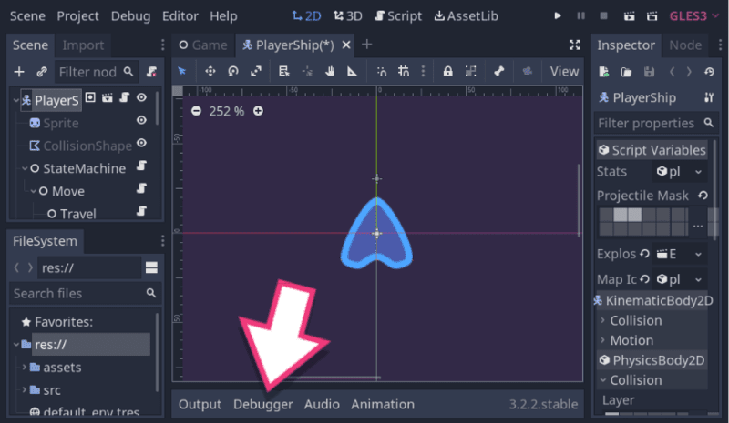
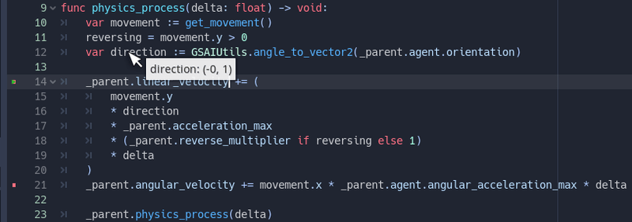
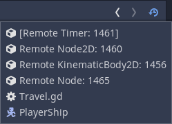

+++
title = "Effective Debugging"
description = "Learn how to debug your project in Godot with the debugger"
author = "razoric"
programVersion = "3.2"

date = 2020-08-17T13:19:24-04:00
weight = 5
draft = true

difficulty = "beginner"
tags = ["tutorial", "godot", "gdscript"]
keywords = ["godot debugging tutorial", "gdscript debugging", "debug gdscript", "debug godot"]
+++

Does your code look like this?

```gdscript
func get_file_data(filepath):
    var file = File.new()

    var error = file.open(filepath, File.READ)

    print(error) # 1...

    var line_length = file.get_32()

    print(line_length) # 2...

    var lines = []

    for _i in line_length:
        lines.append(file.get_line())

        print(lines.front()) # n + 1...

    file.close()

    var data = _parse_data(lines)

    print(data) # and one more

    return data
```

Or an even worse offender, does this?



It'd be a lot easier if you could make the program stop running so you could look at what's in those values directly, wouldn't it?

## Accessing the debugger



## Breakpoints

F9 or click to set breakpoints


When running, execution stops before the line executes


Hover over values



Debugger populated with data

## Parts of a debugger


Reason

Callstack in reverse order

Locals, members, globals


Not debugger specific but can navigate through inspected objects



Toolbar

## Navigating through code line by line

Step Over and Step Into

Continue

Break/Pause Scene
