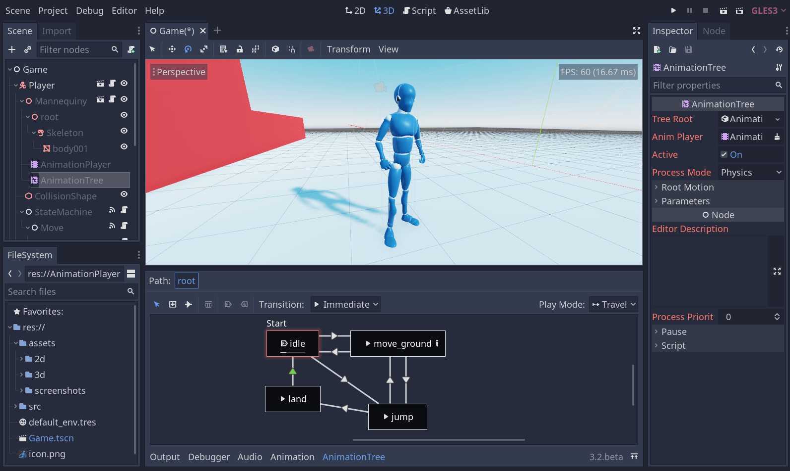

+++
title = "Game Engine Basics"
menuTitle = "Game Engine Basics"

description = ""
author = "razvan"

date = 2020-08-15T21:52:08+03:00
weight = 5
draft = true

difficulty = "beginner"
keywords = ["tutorial"]
+++

Learning a full-featured tool like [Godot](https://godotengine.org) can be overwhelming for beginners. In this tutorial we'll break down how a game engine, works from a programmer point of view, in the context of Godot and GDScript.

We'll learn about:

- What the Godot game engine is
- What are signals and how to coordinate function calls with them
- GDScript basics: input handling and real-time processing

## What is a game engine

Godot is a full-featured tool for making games. Put very simply that is what a game engine is.

The purpose of a Godot is to make game developers' life easier by automating repetitive tasks that appear in all game projects. This comes with advantages and disadvantages.

The advantages are that:

- We don't have to build everything from ground up facilitating fast prototyping and building a workflow pipeline
- Tool makers integrate with existing game engines making it easier to integrate their assets
- Developers can focus on game content rather than technicalities
- Makes it easier for non-coders to participate in the game development process

There are also disadvantages:

- It's harder to control performance since we can't easily tweak the backend code
- Workflows can become highly specialized making it difficult to integrate or expand with exterior tools

Godot is both a game engine and an editor. The editor allows us to visually create our game from different assets while the engine is the framework that allows us to run our games. As a comparison, [Panda3D](https://www.panda3d.org) is a game engine without an editor, also known as SDK (Software Development Kit).

These days we take for granted what Godot has to offer:

- User input handling
- Animation
- Audio
- Navigation
- Internationalization
- GUI (Graphics User Interfaces)
- Networking
- Rendering
- Particle system
- Physics simulations
- Profiling and debugging
- Compile and run projects on multiple platforms

And many more features.

### The game loop

So how does Godot work? The main concept of a game engine is **the game loop**. We can think of the game loop as the heart of the game engine. It's what makes it tick.
