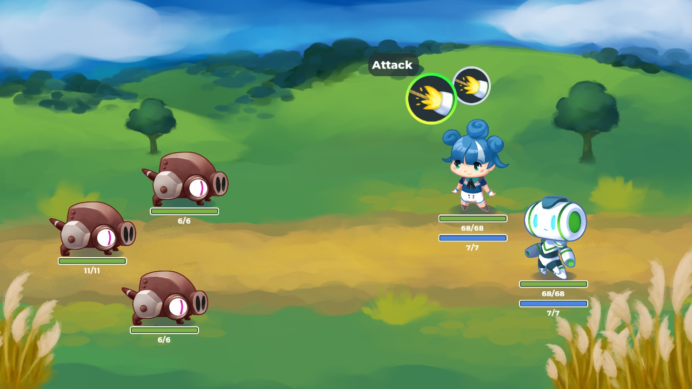

+++
title = "Make Games with Godot: Beginner Edition"
description = "This learning path and free guide is a curated list of free resources to get started with game development using the Free and Open Source engine Godot"

author = "razvan"
date = "2019-11-06T13:12:32+02:00"

type = "post"

weight = 1

aliases = [
    "/open-source/guides/learn-godot/beginner/",
    "/tutorial/godot/learning-paths/beginner/",
    "/tutorial/redirect/guide/beginner/",
    "/docs/guides/learn-godot/beginner/"
]

[[resources]]
name = "banner"
src = "banner.jpg"

[banner]
src = "banner.jpg"
+++

Do you want to learn to make games, but you don't know where to start? Do you have little or no programming experience? This guide is for you!

_If you are an experienced developer, check out [Learn to Make Games with Godot: Developer Edition]() instead._

You can always **join the [GDQuest Discord server](//discord.gg/CHYVgar)** for a welcoming community of game developer and designer enthusiasts. And if you want to **keep up to date** with news from GDQuest we encourage you to **follow the [official Twitter account](//twitter.com/NathanGDQuest)**.

## Become a game developer

We collected and reviewed dozens of **free online resources** to help you learn to make your first video games with the free and open source game engine [Godot](//godotengine.org/). 

This learning path will take you from 0 to your first complete games, albeit small ones.

> The journey of a thousand miles begins with one step.
> 
> Lao Tzu

Your first creation may not be your dream project, but you're going to learn and grow a lot taking your first steps. You're going to discover a world full of wonders where the further you go, the more creative the process becomes.

> It is good to have an end to journey toward; but it is the journey that matters, in the end.
> 
> Ursula K. Le Guin

As you are going to see, there are many great tutorials and tools that you can use to learn game creation from your bedroom for free today.

Now is a great time to learn game development.

## Why Godot? What is Godot?

Godot is a 2D and 3D game engine with a fully-fledged editor, but it is different from the other big game engines out there. It is **Free and Open Source Software**, funded by the community, backed by large organizations like Mozilla or Microsoft, and lead by a team of passionate developers shooting for the stars. 



With **over 1000 contributors** at the time of writing, Godot is becoming more and more competitive even compared to the most significant engines in the games industry.

With separate 2D and 3D engines, an innovative design, it is already packed with a large number of features making 2D game creation fun and rewarding. The team is now working hand-in-hand with the [Vulkan](//www.khronos.org/vulkan/) representatives to provide cutting-edge 3D in version 4.0.

Godot uses the permissive [MIT](//opensource.org/licenses/MIT) license. This means there's no limit to what an excellent team of developers can do with it, even for commercial projects.

## Can I make my dream game?

Game creation takes time and effort. Game developers are people who continuously learn new tricks and learn to enjoy the creation process.

I cannot tell whether you will be able to create your dream project or not, depending on how crazy it is. Still, you can undoubtedly make games that people will enjoy, even alone. It will just take some time and dedication.

> Great things are not done by impulse, but by a series of small things brought together.
> 
> Vincent Van Gogh

## Getting started with game development

The massive amount of information out there on how to get started makes it hard to choose where to start. But we're here to help. 

Below, you'll find lists of **curated free online resources**, in both text and video format, to learn to create your own games from with Godot.

### How to get into game development

This section is for you if you know little about game creation and programming. The guide and videos below give some insights into what you should expect:

1. [Making Your First Game: Basics](//www.youtube.com/watch?v=z06QR-tz1_o&list=PLhyKYa0YJ_5C6QC36h5eApOyXtx98ehGi), by Extra Credits, gives great advice on how to make your first game, and general insights on how games are made.
1. [Become a Game Developer: How to Learn to Code]() is our guide to learn computer programming.
1. [Game Engines: what are they and how to choose the right one?](//youtu.be/2tZK75R2K2c)

 _[OpenRPG](//github.com/GDQuest/godot-open-rpg) in-game screenshot. An example project - turn-based RPG game made with Godot by the GDQuest community._

### Creating your first game with Godot

The best way to learn something new is through a balance of **practice** and brushing your **fundamentals**. 

Here, we've decided to focus on a hands-on approach, which is what we recommend focusing on first: creating actual games. It's motivating to start that way. But we also included a few resources that go through some theory to help you better understand how game engines and programming work.

1. [Intro to GDScript for Programming Beginners](//youtu.be/UcdwP1Q2UlU). Learn Godot's simple programming language for games, **GDScript**. GDScript is designed specifically for games and for Godot so it is faster to pick up than most programming languages out there.
1. [Make Your First 2D Game with Godot](//www.youtube.com/playlist?list=PLhqJJNjsQ7KH_z21S_XeXD3Ht3WnSqW97) is a free course that runs you through the creation of a **2D platform game** from start to finish.
1. [Mobile Game: Circle Jump](//kidscancode.org/godot_recipes/games/circle_jump/) by KidsCanCode is an end-to-end game development series going through the process of building a **one-touch attractive mobile game**.
1. [3D Roll the Ball](//www.youtube.com/playlist?list=PLda3VoSoc_TSBBOBYwcmlamF1UrjVtccZ) by BornCG is a playlist that includes a tutorial series to create a small 3D game from scratch.
1. [Make a Match 3 game like Candy Crush using Godot](//www.youtube.com/playlist?list=PL4vbr3u7UKWqwQlvwvgNcgDL1p_3hcNn2) by Mister Taft Creates is a step-by-step series that goes through the creation of a complete **match-3 game**, like Candy Crush. It is the longest series in this step, requiring some dedication.

 _A complete beginner-friendly [Open Source Project](//github.com/GDQuest/Your-First-Game-Godot-2d-Platformer). Beginners should start small, with manageable projects._

Other useful guides to use along with the videos above:

1. [Godot step-by-step](//docs.godotengine.org/en/latest/getting_started/step_by_step/index.html). The official guide runs you through key Godot features and includes some tutorials. We wrote a fair part of it in collaboration with KidsCanCode.
1. [The GDScript guide](//docs.godotengine.org/en/latest/getting_started/scripting/gdscript/index.html) explains GDScript core concepts. Every Godot game developer will, without a doubt, have to search a thing or two about GDScript and this is the number one place to find the answerers.

### Become a more independent developer

There soon comes a point at which sticking to step-by-step tutorials isn't enough to grow anymore. Most of the learning happens when you **experiment**. For every tutorial you follow, you should spend several hours at least trying to **add new mechanics** to your last project.

After all, the goal is to get to the point where you can make your own games, right? And no tutorial will do that for you.

To get you one step away from the tutorial zone, the resources below go a little deeper into what game design and development are about.

They won't turn you into a pro right away of course, but rather give you a taste of what’s to come:

1. [Game Design Tutorial](//www.youtube.com/playlist?list=PLhqJJNjsQ7KHI3oYZfZ9nLEnQMBEhbmP8) is a playlist - lots of beginner-friendly examples of how to get started on actual (small) game creation, from a designer point of view
1. [Basic Principles of Game Design](//www.youtube.com/watch?v=G8AT01tuyrk) goes through high-level ideas on how to think about objectives that make a game engaging and fun. How to structure the workflow around these ideas
1. [So, You Wanna Make Games](//www.youtube.com/watch?v=RqRoXLLwJ8g&list=PL42m9XiTqPHJdJuVXO6Vf5ta5D07peiVx) is a series by Riot Games, creators of League of Legends, that introduces you to some key art-related jobs in the game industry.

### Going further

Now you got your feet wet with the introductory material above, you want to go further. Here are a few extra resources to explore moving forward.

We've selected the following resources to give you a peek into the vast array of skills a game developer needs to hold or at least know about to be successful:

1. [The Book of Shaders](//thebookofshaders.com/) is one of the best resources out there to get started with shaders, simple programs to manipulate your game's art in realtime, in your game. The book explains how shaders work and what you can achieve with them. At the time of writing this book is incomplete, but still invaluable.
1. [Godot's Introduction to Math for Game Developers](//docs.godotengine.org/en/3.1/tutorials/math/vector_math.html) will give you some insights into the kind of maths you will use often in your games, starting with vectors. If you're allergic to mathematics, you should still give it a read! The approach is different from the way you probably learned at school.
[Omitted long matching line]

The next part in this series, [Learn to Make Games with Godot: Developer Edition](), explores advanced resources for more experienced developers who want to go one step further, or perhaps go from being hobbyists to becoming professionals.

## Contributing to this document

If you want to contribute to this document please read and follow our [Contributing to: Make Games with Godot Guides](). Your support is very appreciated. Please help us improve our quality for everyone!
