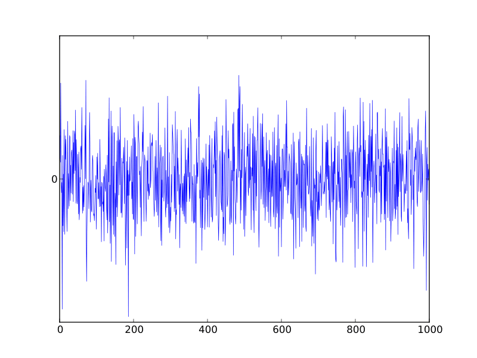
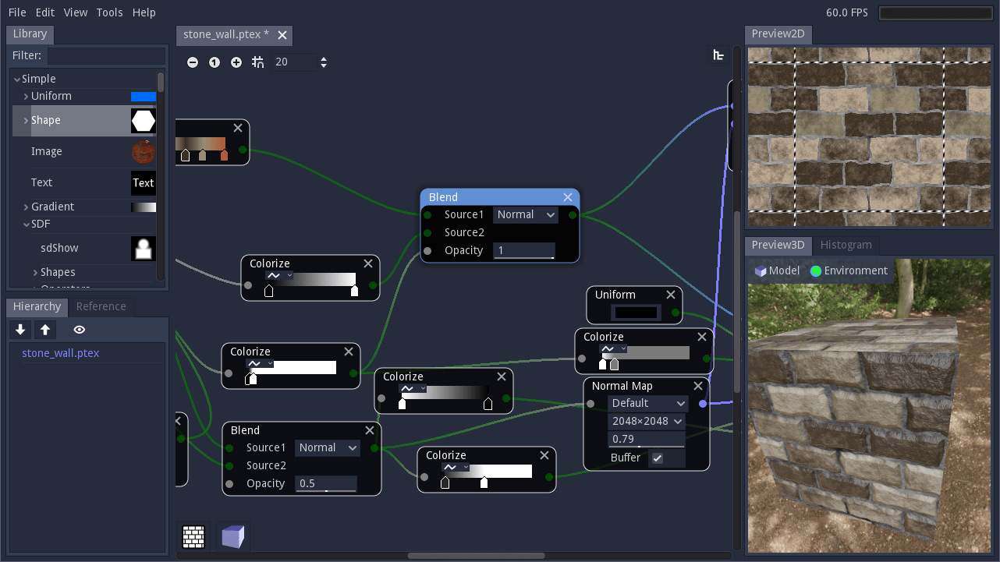
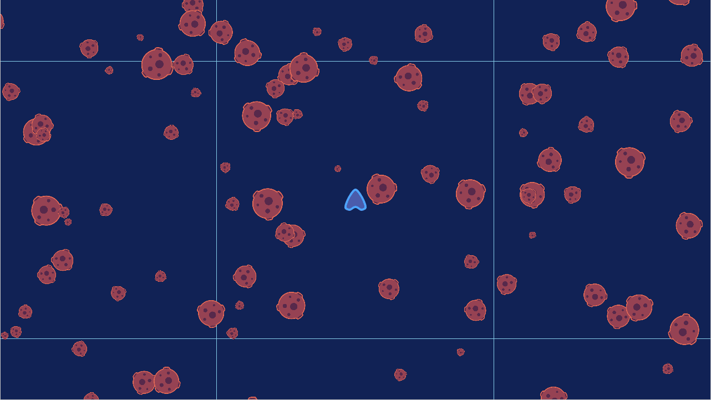
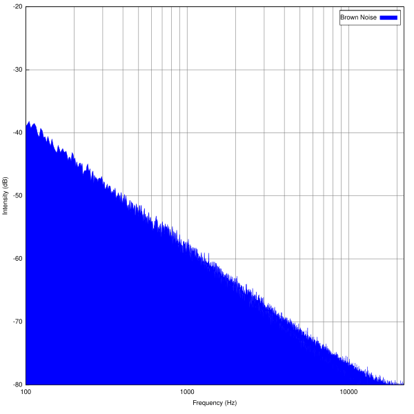
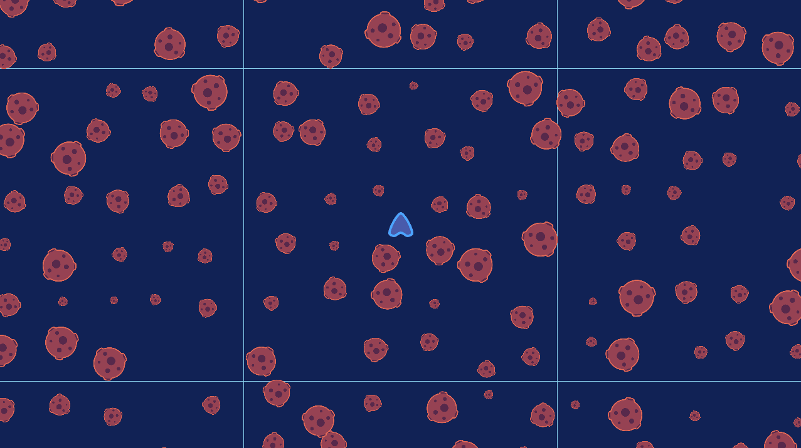

+++
title = "Intro to procedural noise"
description = "Noise generators are the bread and butter of procedural content generation. What are they exactly? That's what you'll learn in this tutorial."
author = "nathan"

date = 2021-01-30
weight = 5
draft = true

difficulty = "beginner"
keywords = ["godot pcg tutorial", "godot noise", "godot procedural generation"]
+++

In this lesson, we will talk about noise in procedural generation and the ways we can use it to generate object positions in Godot.

**This guide was open-sourced from and made possible by our course [Godot PCG Secrets](https://gdquest.mavenseed.com/courses/godot-2d-secrets).**

In computer programming, the word "noise" designates series of random numbers.

If you did a bit of music production or sound design, you probably heard of white noise, a uniformly random signal that sounds a bit like your computer's fans and blowing through your ears.



_CC BY-SA 3.0 Morn - [Wikipedia](https://en.wikipedia.org/wiki/White_noise#/media/File:White_noise.svg)_

We use the same concept of white noise to designate a series of uniformly random numbers in procedural generation. A white noise function generates numbers in the range `[-1, 1]` or `[0, 1]` in such a way that given an output number, you can't know what the next one in the sequence will be.

In Godot, you can generate white noise by filling an array with the `randf()` function. It will create those chaotic series of numbers for you.

```gdscript
## Returns an array of random numbers between `0` and `1`.
func generate_white_noise(sequence_length: int) -> Array:
	var output := []
	# `in number` is a shorthand notation for `in range(number)`
	for i in sequence_length:
		output.append(randf())
	return output
```

Here's the function's output with a `sequence_length` of `10`, rounded to two decimal numbers:

```
[0.73, 0.62, 0.96, 0.97, 0.25, 0.73, 0.35, 0.31, 0.92, 0.41]
```

Notice how two neighboring values can be close, like `0.96, 0.97` and `0.35, 0.31`. This property of white noise can make it a poor choice to randomize loots in a role-playing game or when scattering entities on a map.

The good news is you can produce other kinds of noises by processing white noise.

Then, you can interpret these numbers in any way you want. You can use them to generate graphics, creatures, and more. If you've seen the application [Material Maker](https://github.com/RodZill4/material-maker) made with Godot, it features different kinds of noise generators you can combine to output realistic textures.



We can also use these numbers to generate random positions to place objects on a map, which we will do in this series. Here's one of the simplest functions to generate random positions inside a square (like a grid cell):

```gdscript
func generate_random_position(minimum: float, maximum: float) -> Vector2:
	return Vector2(rand_range(minimum, maximum), rand_range(minimum, maximum))
```

## Different kinds of noises

There are many different noise generation algorithms that we use to produce different outputs.

We talked about white noise, which is chaotic. When you use it to place objects, you can end up with unpredictable and unnatural distributions.

Below, notice how the asteroids stack and clump a lot in some places, and how other areas are empty.



The example above isn't too bad as we place the asteroids in small grid cells, as you'll see in this series. But if you use white noise to distribute objects over a large area, it can get way worse.

When you generate your series of random numbers, producing white noise, you can use a shaping function or some other calculation to control the numbers' distribution.

When you do so, the output has different qualities than white noise. We name those other noises with colors such as blue, violet, pink, etc. Note that the way we define those noises in computer graphics and games is loose compared to audio signals.

For example, to produce red noise, also called brown or Brownian noise, you can generate white noise and average adjacent values, smoothing out the number distribution. It's a version of the white noise with the high frequencies, that is to say, fast changes in numbers, averaged out, as illustrated in the audio waveform below.



_CC BY-SA 3.0 Warrakkk - [Wikipedia](https://en.wikipedia.org/wiki/Brownian_noise#/media/File:Brown_noise_spectrum.svg)_

On the other hand, blue noise designates a noise without low frequencies, that is to say, without slow and gradual changes in values. When you're trying to generate positions on a map, low frequencies result in objects being placed close to one another. With only the high frequencies, you can space things out and make the distribution look more uniform and generally more natural than with white noise. 



Blue noise is what we'll ultimately use to place our asteroids in space. It is a bit more performance-intensive than the white noise, as you will see, but still plenty fast for modern phones and computers.

There are different algorithms and implementations to create blue noise. When it comes to audio signals, the code can get complicated, with hundreds of lines. In games and computer graphics, we use a looser definition: blue noise designates any algorithm that creates randomized sequences of numbers with a fairly uniform distribution, as seen in the image above.

When generating random positions, we can use a simple strategy to keep scripts relatively short and easy to read: taking a grid and spliting it into smaller rows and columns, then placing at most one object per cell.

You can find open-source code examples that show just that in our [Godot Procedural Generation](https://github.com/GDQuest/godot-procedural-generation) project, in the `SpaceInfiniteGeneration/` directory. There, you'll find two scenes illustrating and algorithms to generate white and blue noise: `WhiteNoiseGenerator` and `BlueNoiseGenerator`.

**This guide is an excerpt from our course dedicated to procedural content generation, [Godot PCG Secrets](https://gdquest.mavenseed.com/courses/godot-pcg-secrets). If you'd like an in-depth course on the topic, covering many algorithms and projects, check it out!**
