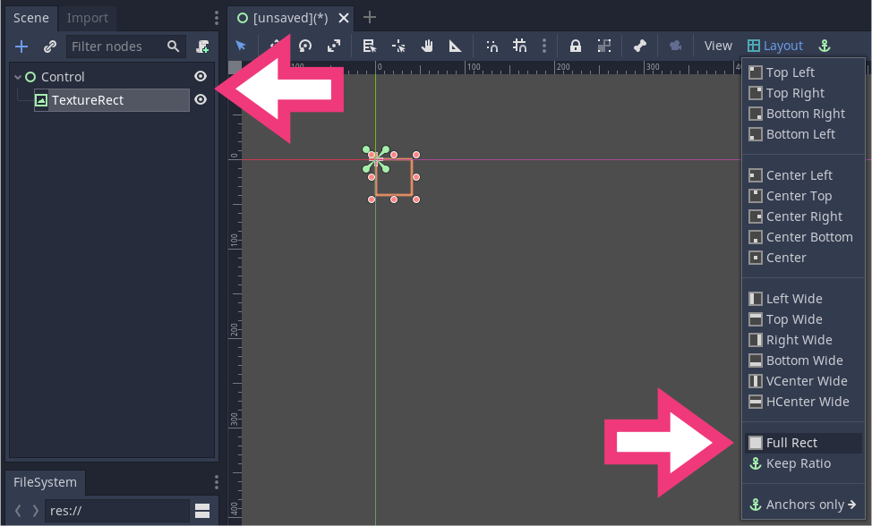
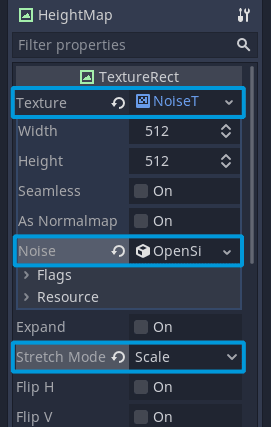

+++
title = "Heightmap-based procedural world map"
description = "Learn to use noise textures to generate a procedural world map and get started with Procedural Content Generation."
author = "razvan"

date = 2020-05-20T10:51:41+03:00
weight = 5
draft = true
+++

This tutorial goes over a simple world map generator using _NoiseTexture_, a modified _GradientTexture_, and shaders.

Objectives:

- Understand _NoiseTexture_ with _OpenSimplexNoise_ to create height maps for use in shaders.
- Modify _GradientTexture_ for our needs to use it as a discrete color map in shaders.
- Use basic shaders with input from GDScript.
- Use `tool` to run GDScript in the editor for immediate feedback.

## Preparing the scene structure

Create the following _SceneTree_ structure:



And rename the nodes like so:

```
WorldMap
  |
  +- HeightMap
  +- PostProcess
```

Select both _HeightMap_ and _PostProcess_ nodes and make sure to set _Full Rect_ in the _Layout_ drop-down menu:


Turn the visibility off for _PostProcess_ for now to see what's happening with _HeightMap_ as we work on the node.

With the _HeightMap_ node selected:

1. Set _Texture_ to _NoiseTexture_ and make sure to assign an _OpenSimplexNoise_ resource to the _Noise_ property.
1. Also make sure to set _Stretch Mode_ to _Scale_.



Save the scene as _WorldMap.tscn_.

## DiscreteTexture resource

We're done preparing the scene. Create a new GDScript file called `DiscreteTexture.gd` with the following code:


tool
class_name DiscreteTexture
extends GradientTexture


# Upon creating a new texture, we set its width to 256 pixels.
func _init() -> void:
	width = 256


# Creates a new image texture that converts a smooth gradient to an image with discrete areas of 
# color.
func discrete() -> ImageTexture:
	var out := ImageTexture.new()
	# We must have a valid gradient resource attached to this object to render the discrete texture.
	if gradient != null:
		var image := Image.new()
		image.create(width, 1, false, Image.FORMAT_RGBA8)
		image.lock()

		var point_count := gradient.get_point_count()
		for index in (point_count - 1) if point_count > 1 else point_count:
			var offset1: float = gradient.offsets[index]
			var offset2: float = gradient.offsets[index + 1] if point_count > 1 else 1
			var color: Color = gradient.colors[index]
			for x in range(width * offset1, width * offset2):
				image.set_pixel(x, 0, color)
		image.unlock()
		out.create_from_image(image, 0)
	return out


_Note_ the use of `tool` in the script. This will allow us to use the `discrete()` function inside the editor for immediate feedback.

This class inherits from `GradientTexture`. We add the `discrete()` function to it, which allows us to convert to `ImageTexture` based on the gradient offsets and colors.


## Implementing the HeightMap

With the _HeightMap_ node selected add the following shader:


shader_type canvas_item;


uniform sampler2D colormap : hint_black;
uniform float height_map_min = 0.0;
uniform float height_map_max = 1.0;


void fragment() {
	float noise = (texture(TEXTURE, UV).r - height_map_min) / (height_map_max - height_map_min);
	COLOR = texture(colormap, vec2(noise, 0.0));
}


The final piece is this _HeightMap_ script:


tool
extends TextureRect


const L8_MAX := float(0xff)

export var colormap: Texture = DiscreteTexture.new()


func _ready() -> void:
	colormap.connect("changed", self, "_on_Colormap_changed")
	texture.connect("changed", self, "_on_HeightMapTexture_changed")
	_on_Colormap_changed()
	_on_HeightMapTexture_changed()


func _on_Colormap_changed() -> void:
	if not colormap is DiscreteTexture:
		return
		
	if colormap.gradient != null and not colormap.gradient.is_connected("changed", self, "_on_Colormap_changed"):
		colormap.gradient.connect("changed", self, "_on_Colormap_changed")
	
	material.set_shader_param("colormap", colormap.discrete())


func _on_HeightMapTexture_changed() -> void:
	var height_map_image := texture.get_data()
	if not height_map_image:
		return
	
	height_map_image.convert(Image.FORMAT_L8)
	var height_map_minmax := get_minmax(height_map_image.get_data())
	material.set_shader_param("height_map_min", height_map_minmax.min / L8_MAX)
	material.set_shader_param("height_map_max", height_map_minmax.max / L8_MAX)


func get_minmax(array: Array) -> Dictionary:
	var out := {"min": INF, "max": -INF}
	for value in array:
		out.min = min(out.min, value)
		out.max = max(out.max, value)
	return out


What we do here is to set reactions to changes in the textures we use: the _NoiseTexture_ and the _DiscreteTexture_ so that we see feedback in the editor directly.

For this to work you have to close and reopen the _HeightMap_ scene so that the Godot applies the script in the editor.

_OpenSimplexNoise_ generates values from `0` to `1`, but they usually fall within a narrower range, something like: `0.123` to `0.832` for example. To get the full range from `0` to `1` we find the minimum and maximum values in the noise texture and pass them to the shader as `height_map_min` and `height_map_max`.

In the shader we remap the noise values to the `[0, 1]` interval:


float noise = (texture(TEXTURE, UV).r - height_map_min) / (height_map_max - height_map_min);


So we can use them with the full extent of the `colormap`:


COLOR = texture(colormap, vec2(noise, 0.0));


Play with a `colormap` setting of your choosing such as:


## Adding outlines with a Sobel shader

As a final let's add an edge to separate our _HeightMap_ colors.

Unhide the _PostProcess_ node and add a material with the following screen-space shader:


shader_type canvas_item;


uniform vec4 edge_color : hint_color;
uniform vec2 delta = vec2(0.5);


float sobel(sampler2D tex, vec2 uv, vec2 pixel_size) {
	vec2 delta_pixel = delta * pixel_size;
	
	vec4 h = vec4(0.0);
	vec4 v = vec4(0.0);
	
	h +=       texture(tex, uv + vec2(-1.0, -1.0) * delta_pixel);
	h -=       texture(tex, uv + vec2( 0.0, -1.0) * delta_pixel);
	h += 2.0 * texture(tex, uv + vec2(-1.0,  0.0) * delta_pixel);
	h -= 2.0 * texture(tex, uv + vec2( 1.0,  0.0) * delta_pixel);
	h +=       texture(tex, uv + vec2(-1.0,  1.0) * delta_pixel);
	h -=       texture(tex, uv + vec2( 1.0,  1.0) * delta_pixel);
	
	v +=       texture(tex, uv + vec2(-1.0, -1.0) * delta_pixel);
	v += 2.0 * texture(tex, uv + vec2( 0.0, -1.0) * delta_pixel);
	v +=       texture(tex, uv + vec2( 1.0, -1.0) * delta_pixel);
	v -=       texture(tex, uv + vec2(-1.0,  1.0) * delta_pixel);
	v -= 2.0 * texture(tex, uv + vec2( 0.0,  1.0) * delta_pixel);
	v -=       texture(tex, uv + vec2( 1.0,  1.0) * delta_pixel);
	
	return sqrt(dot(h, h) + dot(v, v));
}


void fragment() {
	float s = sobel(SCREEN_TEXTURE, SCREEN_UV, SCREEN_PIXEL_SIZE);
	COLOR = texture(SCREEN_TEXTURE, SCREEN_UV);
	COLOR = mix(COLOR, edge_color, s);
}


It's a simple [Sobel shader](https://github.com/spite/Wagner/blob/master/fragment-shaders/sobel-fs.glsl) I found online and adapted for use in Godot.

Play with the _Edge Color_ and _Delta_ values in the _Inspector_ under _Shader Param_ for a different look.

## Project files

In [the attached project](./files/world-map.zip) you can find the final result plus a bonus scene called _GradientDiscrete.tscn_ which presents the _GradientTexture_ to _DiscreteTexture_ conversion interactively in the Godot editor.
